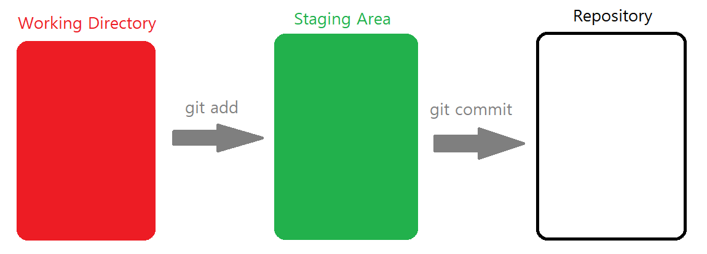

# Git이란?

- 🌟**Git은 분산버전관리시스템(DVCS) ** : 🌟

- 모든 히스토리를 클라이언트들이 공유

- 버전 : 컴퓨터 소프트웨어 특정 상태

- 버전 관리 시스템 : 여러 버전을 관리하는 것

  

- **C**ommand **L**ine **I**nterface(명령 줄 조작) : 명령어 인터페이스
  - ☢ ***명령을 하고 결과를 꼭 읽기!***
  - 터미널을 이용해서 명령
-  **G**raphic **U**ser **I**nterface(그래픽 유저 조작)

## 디렉토리 명령어
- CLI 인터페이스를 위한 명령어
- $ : 명령하는 줄의 시작
- **pwd(print working directory)** : 현재 디렉토리 출력
- **cd(change directory)** : 디렉토리 이동 
  - .  : 현재 디렉토리
  -  .. : 상위 디렉토리(cd .. 띄어쓰기 신경쓰기!)
- **ls(list)** : 목록
- **mkdir(make directory)** : 디렉토리 생성(폴더)
- **touch** : 파일의 날짜와 시간을 수정(0바이트 생성) ($ touch a.txt)
- **rm(remove)** : 파일삭제
- **rm -r** : 폴더 삭제
- **Ctrl + L(clear)** : 터미널 기록 삭제
- **Ctrl + C** : 커맨드 명령 취소
- 파일 이름의 띄어쓰기는 역슬래쉬(\\)로 표시 
  - 불편하므로 영어나 _(언더바)로 표시하는 것이 좋다

- 파일 이름 누르고 tap을 누르면 자동으로 경로를 찾아줌.

# Git 사용하기

## GIt 원리

1) <u>작업을 하고</u> (1통)
2) <u>변경된 파일을 모아</u> (add) -> staging Area(중간 공간)에 저장 (2통)
   - 파일들이 여러개 있는 경우 부분적으로 버전 생성이 가능하게 만들어줌. 내가 버전으로 기록하기 위한 파일들을 staging Area공간에 모은다.
   - 임시 공간
3) <u>버전으로 남긴다</u> (commit) (3통)

## Git 명령어

- **git init** -> (master) git에 기록하기 시작할 장소에서 시작. 해당 폴더의 변경사항들이 관리됨

- **git add <file>** : 1통->2통, 빨간색에서 초록색으로 변경. 파일이 옮겨지는 것이 아닌 상태가 변경
  - **git add .** : 모든 파일을 add시킴

- **git status** : git이 추적하는 상태를 확인.(파일들의 상태) 
  - cd .git : git으로 들어가는 방법 -> (GIT_DIR!) ☠ 혼나기 싫으면 들어가지 말 것!  ☠

- **git commit -m '<커밋메시지>'**  : 2통->3통

  커밋메시지는 상세하게 적어 무슨 수정이 생겼는지 알 수 있게 하는 것을 추천.

- **git status** : 현재 파일들 상태 조회.

- **git log** : 저장소에 기록된 커밋(버전)을 조회.
  - git log -1 : 최근 1개(바로 직전)의 커밋을 조회
  - git log --oneline : 한 줄로 보여줘
  - git log -2 --oneline : 최근 2개를 한 줄로 보여줘
  - git log --oneline --graph :  그래프로 보여줘
