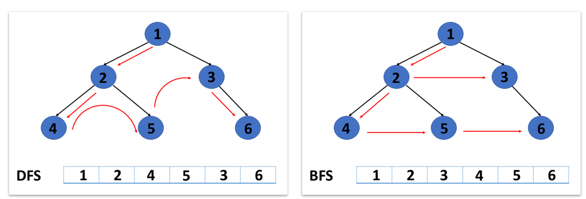

# 1. 그래프 탐색 알고리즘

- 그래프 자료구조는 탐색 알고리즘에 활용된다

## 그래프 탐색 알고리즘

- 시작 정점에서 **간선을 타고 이동할 수 있는 모든 정점을 찾는** 알고리즘

- 깊이 우선 탐색과 너비 우선 탐색이 있음
  스택 + 그래프 + 큐

- 스택 + 그래프 : 깊이 우선 탐색 그래프의 깊이를 우선으로 탐색하기 위해 스택의 개념을 활용한다.

- 그래프 + 큐 : 너비우선 탐색 그래프의 너비를 우선으로 탐색하기 위해 큐의 개념을 활용한다.

- DFS vs BFS
  
  

- BFS(최단 거리) 헷갈리므로 수업 시간에선 DFS만 할 예정!

# 2. DFS

- 시작 정점으로부터 **갈 수 있는 하위 정점까지 가장 깊게 탐색**하고,
  더 이상 갈 곳이 없다면 마지막 갈림길로 돌아와서 다른 정점을 탐색하며 결국 모든 정점을 방문하는 순회 방법
- 미로 탈출로 생각
  - 어느 한 쪽 길로 가장 깊게 들어갔다가 막히면 다시 돌아와서 다른 길을 탐색

## 특징

- 모든 정점을 방문할 때 유리
- 경우의 수, 순열과 조합 문제에서 많이 사용
- BFS에 비해 코드 구현이 간단
- 단, 모든 정점을 방문할 필요가 없거나 최단 거리를 구하는 경우에는 BFS가 유리

# 3. DFS 동작과정

- DFS를 하기 전, 탐색을 진행할 그래프가 필요
  - 그래프는 인접 행렬 혹은 인접 리스트 방식으로 표현
    - 인접 리스트 방식이 더 편리
- 각 정점을 방문했는지 여부를 판별할 방문 체크 리스트가 필요하다.
  - 사람과 달리 컴퓨터는 각 정점에 방문했는지 여부를 알 수 없다.
  - 따라서 vissted 리스트를 따로 선언하여 각 정점을 방문했는지 체크한다.

```python
visited = [False] * n # n은 정점의 개수 
```

## DFS의 사이클

1. 현재 정점 방문 처리
2. 인접한 모든 정점 확인
3. 방문하지 않은 인접 정점 이동

# 4. 구현 방식

- 인접 리스트로 표현한 그래프
  
  ```python
  graph = [
  [1,2],
  [0,3,4],
  [0,4,5],
  [1],
  [1,2,6],
  [2],
  [4]
  ]
  ```

- 반복문을 이용한 DFS
  
  - DFS는 직전에 방문한 정점으로 차례로 돌아가야 하므로, 후입선출 구조의 스택을 사용
    
    ```python
    visited= [False] * n # 방문 처리 리스트 만들기
    def dfs(start):
    stack = [start] # 돌아갈 곳을 기록
    visited[start] = True # 시작 정점 방문 처리
    while stack: # 스택이 빌 때까지(돌아갈 곳이 없을때까지) 반복
    cur = stack.pop() # 현재 방문 정점(후입선출)
    for adj in graph[cur]: # 인접한 모든 정점에 대해
      if not visted[adj]: # 아직 방문하지 않았따면
        visited[adj] = True # 방문 처리
        stack.append(adj) # 스택에 넣음
        
        dfs(0)

```

5. 구현 
- BOJ 2606

6. 이차원 격자에서의 DFS