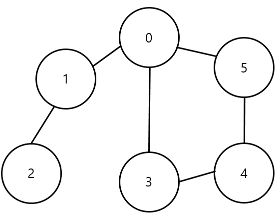
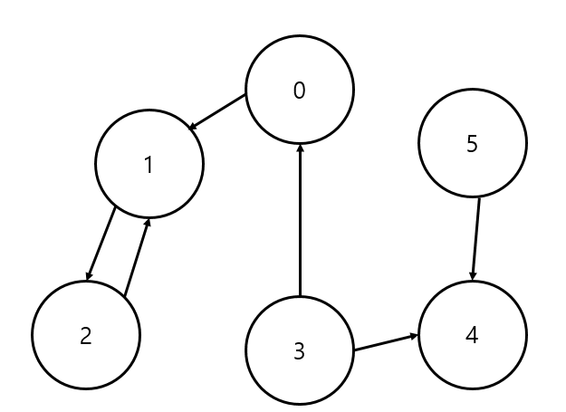

# 1. 그래프에 대한 이해

- **정점(Vertex)**과 이를 연결하는 **간선(Edge)**들의 집합으로 이루어진 비선형 자료구조

## 그래프 관련 용어

- 정점(Vertex) : 간선으로 연결되는 객채, 노드(Node)라고도 한다.
- 간선(Edge) : 정점 간의 관계(연결)를 표현하는 선
- 경로(Path) : 시작 정점부터 도착 정점까지 거치는 정점을 나열한 것
- 인접(Adjacency) : 두 개의 정점이 하나의 간선으로 직접 연결된 상태를 의미

# 2. 그래프의 종류

1. 무방향 그래프(Undirected graph)
   
   
- 간선의 방향이 없는 가장 일반적인 그래프
- 간선을 통해 양방향의 정점 이동 가능
- 차수(Degree) : 하나의 정점에 연결된 간선의 개수
- 모든 정점의 차수의 합 = 간선 수 x 2
2. 유방향 그래프(Directed graph)
   
   - 간선의 방향이 있는 그래프
   - 간선의 방향이 가리키는 정점으로 이동 가능
   - 차수(Degree) : 진입 차수와 진출 차수로 나누어짐
     - 진입 차수(In-degree) : 외부 정점에서 한 정점으로 들어오는 간선의 수
     - 진출 차수(Out-degree) : 한 정점에서 외부 정점으로 들어오는 간선의 수

# 3. 그래프의 표현

1. 인접 행렬 (Adjacent matrix)
- 두 정점을 연결하는 간선이 없으면 0, 있으면 1을 가지는 행렬로 표현하는 방식 
  
  ```python
  edges = [
  [0,1],
  [0,2],
  [1,3],
  [1,4],
  [2,4],
  [2,5],
  [4,6]
  ]
  # 정점 구하기
  # set(*edges)
  # * : flatten
  # flatten_edges = [0,1,0,2,1,3,1,4,2,4,2,5,4,6]
  n = 7
  m = 7
  
  # n x n 행렬 초기화 [0으로 초기화]
  matrix = [[0] * n for _ in range(n)]
  for _ in range(m):
  v1, v2 = map(int, input().split())
  graph[v1][v2] = 1
  graph[v2][v1] = 1
  for edge in edges:
  v1, v2 = edge[0], edge[1]
  matrix[v1][v2] = 1
  matrix[v2][v1] = 1
  ```

2 인접 리스트 (Adjacent list)

- 리스트를 통해 각 정점에 대한 인접 정점들을 순차적으로 표현하는 방식

```python
n = 7
m = 7

graph = [[] for _ in range(n)]

for _ in range(m):
  v1, v2 = map(int, input().split())
  graph[v1].append(v2)
  graph[v2].append(v1)
```

- 인접 행렬 vs 인접 리스트
  - 인접 행렬은 직관적이고 만들기 편하지만, 불필요하게 공간이 낭비된다.
  - 인접 리스트는 연결된 정점만 저장하여 효율적이므로 자주 사용된다.