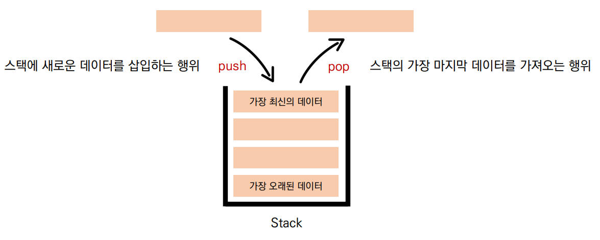
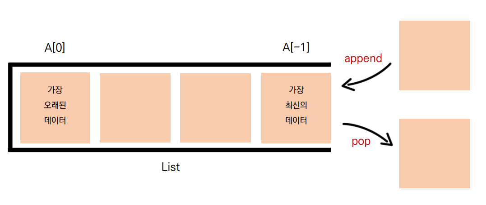
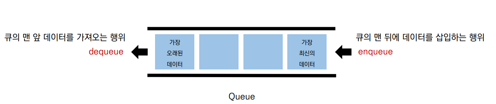
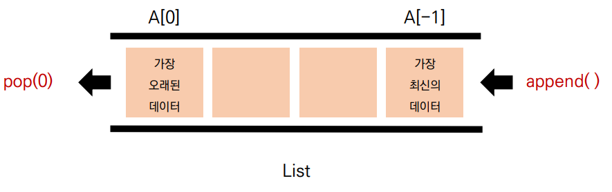
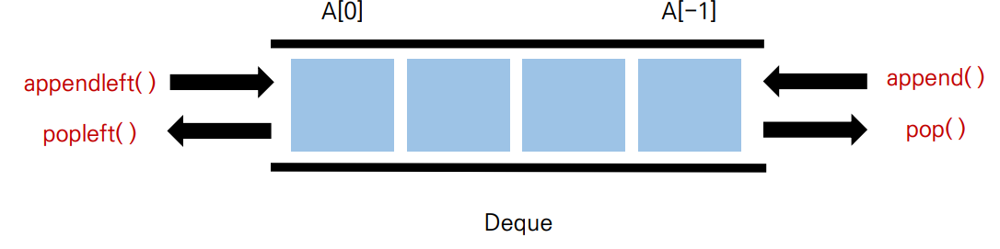

- 왜 써야 하는가?
- 언제 써야 하는가?

# 1. 스택(stack)

- stack은 쌓는다는 의미로써, 데이터를 한쪽에서만 넣고 빼는 자료구조
- 가장 마지막에 들어온 데이터가 가장 먼저 나가므로 LIFO(Last-in First-out 후입 선출) 방식

## 대표 동작

- push : 스택에 새로운 데이터를 삽입하는 행위 
- pop : 스택의 가장 마지막 데이터를 가져오는 행위
  

## 특징

후입선출 : 들어온 순서와 반대로 나감

## 왜 stack을 써야할까(why) ?

- stack이 필요한 이유 == Stack의 Use Case
1. 뒤집기, 되돌리기, 되돌아가기 
   - 브라우저 히스토리, ctrl + z, 단어 뒤집기
2. 마무리 되지 않은 일을 임시 저장
   - 괄호 매칭, 함수 호출, 백트래킹, DFS(깊이 우선 탐색)

## 파이썬

- 리스트로 스택을 간편하게 사용할 수 있다!
  
- append는 마지막에 데이터 추가, pop은 마지막 데이터 제거

# 2. 큐(Queue)

- Queue는 한 쪽 끝에서 데이터를 넣고, 다른 한 쪽에서만 데이터를 뺄 수 있는 구조
- 가장 먼저 들어온 데이터가 가장 먼저 나가므로 FIFO(First-in First-out, 선입선출) 방식

## 대표 동작

- enqueue : 큐의 맨 뒤에 데이터를 삽입하는 행위
- dequeue : 큐의 맨 앞 데이터를 가져오는 행위
  

## 파이썬

- 리스트로 간편하게 사용할 수 있다!
  

## 리스트를 이용한 큐 자료구조의 단점

- 데이터를 뺄 때 큐 안에 있는 데이터가 많은 경우 비효율적
  
  - 맨 앞 데이터가 빠지면서, 리스트의 인덱스가 당겨지기 때문

# 덱(Deque, Double-Ended Queue) 자료구조

- 양 방향으로 삽입과 삭제가 자유로운 큐
- 양 방향, 삽입 추출이 모두 큐보다 훨씬 빠름
  
- 데이터의 삽입, 추출이 많은 경우, 시간을 크게 단축시킬 수 있음