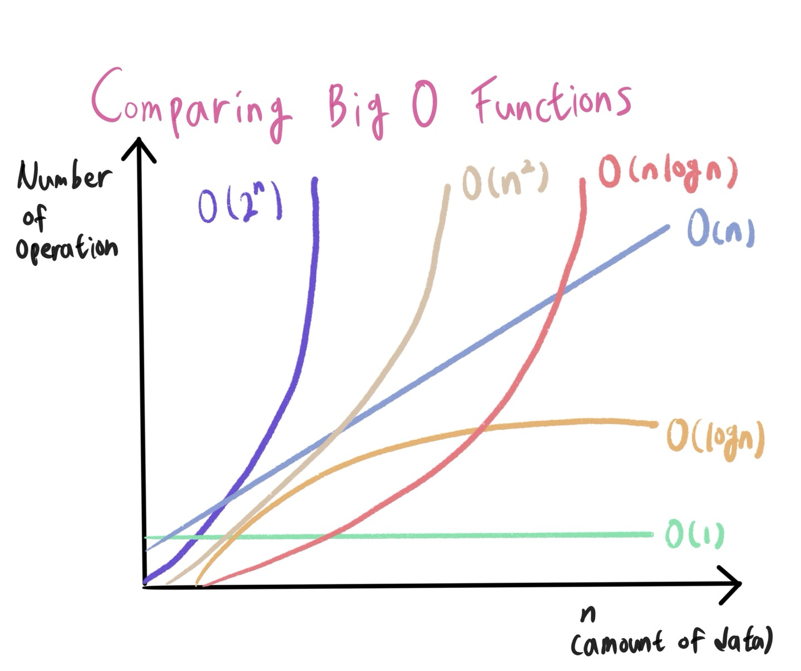

# 1. 알고리즘의 시간 복잡도

- 좋은 알고리즘이란 무엇일까? == 효율성이 좋은 알고리즘? == 성능이 좋은 알고리즘? == Input을 넣은 후 Output이 나오는 시간이 짧은 알고리즘!
- 알고리즘의 소요 시간 측정하기 -1
  - 개개인의 컴퓨팅 환경에 따라 같은 알고리즘이라도 측정 시간이 다르다. 환경에 영향을 받지 않는 객관적인 기준이 필요하다!
  - 객관적인 측정을 위해 알고리즘 내부에서 <U>기본연산</U>이 몇 번 일어나는지 살펴본다.
    - 기본연산 : 단위 시간 1이 소요되는 연산 ex) 할당, 산술, 비교, 반환,...
    - 기본연산의 총 횟수 == 알고리즘의 소요 시간
    - ~~~
    - 따라서 성능을 측정할 때는 **입력을 통일**. 가장 기본연산이 많이 일어나는 <U>최악의 입력 n개</U>가 들어온다고 가정한다.
    - 입력 n개에 따른 소요 시간을 수식으로 세울 수 있다. == 시간 복잡도(Time Complexity)

## 시간 복잡도(Time Complexity)

- 계산 복잡도 이론에서 시간 복잡도는 <u>문제를 푸는데 걸리는 시간과 입력의 함수 관계</u>를 가리킨다. 
- 단순하게 알고리즘의 수행시간을 의미
  - 시간 복잡도가 높다 -> 느린 알고리즘
  - 시간 복잡도가 낮다 -> 빠른 알고리즘

# 2. 빅오(Big-O) 표기법

- 정확한 수치보다는 **증가율**에 초점을 맞춘다.

## 다양한 시간 복잡도 종류 살펴보기

  

- O(1) : 상수 복잡도, 단순 산술 계산(덧셈, 뺄셈, 곱셈, 나눗셈) / 단순계산 -> a+b, 100*200

- O(logN) : 크기 N인 리스트를 반절씩 순회/탐색  / 이진탐색(Binary Search), 분할정복(Divide & conquer)

- O(N) : 선형 함수, 크기 N인 리스트를 순회, count 함수 / 리스트 순회, 1중 for문

- O(NlogN) : 크기 N인 리스트를 반절씩 탐색*순회 / 높은 성능의 정렬(Merge/Quick/Heap Sort)

- O(N^2) : 크기 M, N인 2중 리스트를 순회 / 2중 리스트 순회, 2중 for문

- O(N^3) : 3중 리스트를 순회 / 3중 리스트 순회, 3중 for문

- O(2^N) : 크기 N 집합의 부분 집합 / 크기가 N인 집합의 부분 집합

- O(N!) : 크기 N 리스트의 순열 / 크기가 N인 순열

- 같은 Output을 만드는 알고리즘이라도 시간 복잡도에 따라

- 내장 함수, 메서드의 시간 복잡도도 확인할 필요가 있다.
  
  - for문이 한 번이라고 해서 무조건 O(n)인 것은 아니다.
  - for문 안에 O(n)의 내장 함수를 사용했따면 사실상 이중 for문과 다를 것이 없다.
    [파이썬 시간복잡도](https://wiki.python.org/moin/TimeComplexity)