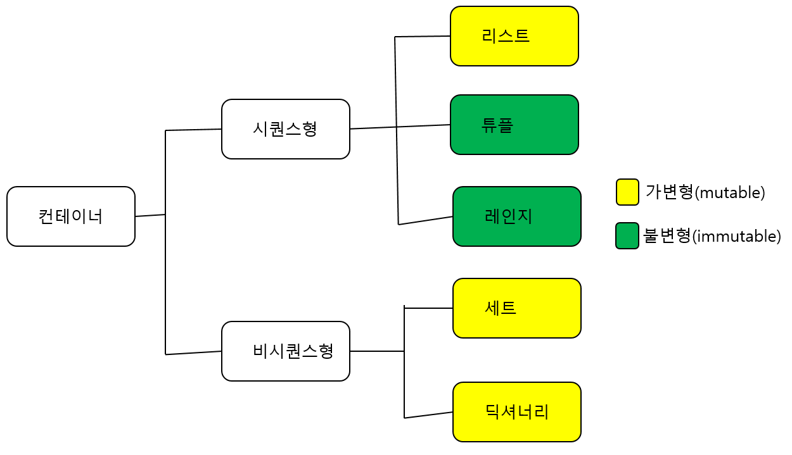

# 알고리즘 INTRO

## 1. 알고리즘? 코딩테스트?

### - 알고리즘 : 어떤 **문제**를 **해결**하기 위해 정해진 일련의 절차나 행동

- **문제** : Input을 넣었을 때, 원하는 Output이 나오도록 하는 것

### - 코딩 테스트 : 기업에서 지원자를 대상을 코딩을 통한 알고리즘 기반 문제 해결 능력을 테스트 하는 것

- 평가하는 두 가지 사항
  1. 문제 해결력 : 문제 **의도**를 정확히 파악하고, 적절한 **해결** 방법을 적용할 수 있는가?
  2. 구현력 : 해결 방법을 **프로그래밍**을 통해 능숙하게 구현할 수 있는가?
- 코딩테스트가 현업 능력을 평가할 수 있을까?
  - 실제 현업 환경과 달리 **객체 지향적**으로 코드를 작성하지 않으므로 완벽하게 현업 능력을 평가할 수는 없지만, 신입의 실력을 어느 정도 측정하는 데 좋은 지표가 된다!

## 2. 코딩 테스트 종류

- 온라인
  - 사전에 연습장과 필기도구 준비
  - 테스트 케이스 이외의 *엣지 케이스*도 확인
  - 인터넷, IDE, 알고리즘 노트 적극 활용
    - [참고 사이트](https://github.com/ndb796/Python_Competitive-Programming-Team_Notes)
- 오프라인
  1. 개발형 코딩테스트(Rest API, json)
  2. 화이트보드 손코딩
     - 지원자가 어떤 방식으로 문제를 해결하는지 **논리**, **과정**, **커뮤니케이션**스킬을 평가
- 기업별
  - 기업별 분석 자료 분석하기

## 3. 코딩테스트 준비하기

- **많이 풀기**
- 대표 문제 풀이 사이트 : 백준, 프로그래머스, 코드업, SWEA
- 문제는 매번 풀 때마다 다른 유형을 푸는 것이 좋다? 
  - (X) 연습 때는 같은 유형 문제를 단기간에 여러 번 반복하는 것이 좋고 코딩테스트 직전에는 모의고사처럼 시간 제한을 두고 여러 유형을 푸는 것이 좋다.
- 오랜 시간 고민했는데 풀리지 않을 때, 끝까지 답을 보지 않는 것이 좋다?
  - (X) 다만, 이후에 답을 보지 않고 반드시 한번 더 풀어서 내 것으로 만들어야 한다. 최대한 타인의 답을 보면서 여러 풀이를 습득하는 것이 좋다.
  - 아주 간단한 문제는 한 시간, 복잡한 문제는 두 시간.
- 알고리즘 문제는 몇 문제 정도 풀어야 할까?
  - 약 300~350 문제(기초 100, 중급 100, 고급 100)정도 풀면 대부분의 코딩테스트에 무난하게 합격할 수 있다.
- 기타 꿀팁
  - 변수명 대충 짓지 않기(ex. a, b, c, ...)
  - 언어가 가지는 내장 함수, 라이브러리를 적극 활용 하기
  - 반복되는 코드는 함수화를 통해 가독성 있게 작성하기
    - 문제가 너무 쉽다면 함수를 만들어서 풀어볼 것!
  - <u>면접을 위해 풀이를 남에게 설명하는 연습 반드시 필요</u>
- 알고리즘 3대장
  - 이중 배열
  - 그래프
  - DP
  - 을 뚫어내야 한다!

## 4. 데이터 구조 & 알고리즘

- 프로그램 = 데이터 구조(저장) + 알고리즘(조작)
  
  ### 데이터 구조(Data Structure)

- 데이터를 다양한 방식을 **저장**하고 + 조회,삽입,변경 삭제와 같은 **조작** 기능을 제공한다.

- 왜 데이터 구조가 중요한가? 그냥 아무데나, 아무렇게나 담으면 안될까?
  
  - 아무데나 담기 ~ = 변수
  - **문제 상황**에 따라 **더 적합한 통**이 필요하다!
  - **문제 상황**에 따라 **더 적합한 도구**가 필요하다!
  - 물통 == 물 + 통 -> 물을 <U>필요에 따라 저장하고 활용</U>할 수 있으므로 **문제를 더 효율적으로 풀기 위한 도구**가 된다.
  - 데이터 구조 == 데이터 + 구조 -> 데이터를 <U>필요에 따라 저장하고 활용</U>할 수 있으므로 **문제를 더 효율적으로 풀기 위한 도구**가 된다.

- 구조를 안다는 것 : 어떻게 **저장**하고 & 어떻게 **활용**(조작)할 수 있는지

- 파이썬의 기본 데이터 구조

- 시퀀스형 : 순회가능(iterable) -> 순회가 가능하기 때문에 인덱스, 슬라이싱 가능

- 코딩 테스트 정복을 위한 데이터 구조와 알고리즘
  
  | 데이터 구조                                                                                                                                      | 알고리즘                                                                                       |
  | ------------------------------------------------------------------------------------------------------------------------------------------- | ------------------------------------------------------------------------------------------ |
  | Array(연결) Linked List(연결리스트) Hash(해시) Stack(스택) Queue(큐) Priority Queue(우선순위 큐) Heap(힙) Tree(트리) Graph(그래프) | [기본] 완전탐색, 재귀, 시뮬레이션, 그리디  [심화] DFS, BFS, 백트래킹, 이진탐색, DP,  다익스트라, 크루스칼, 프림 |