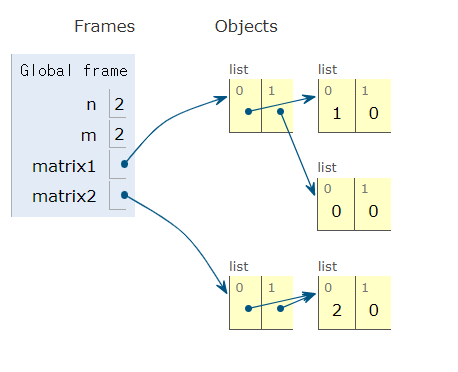
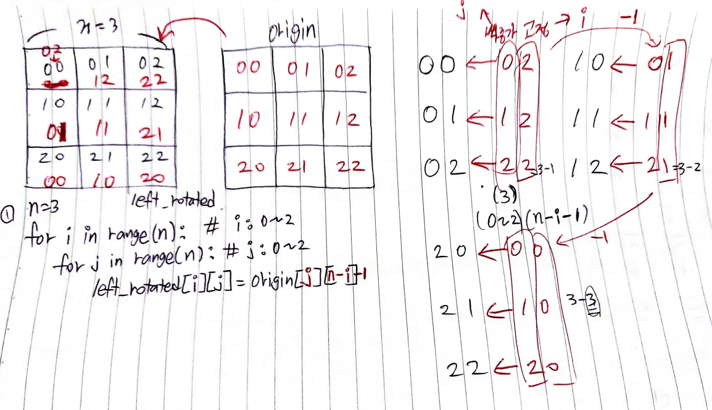
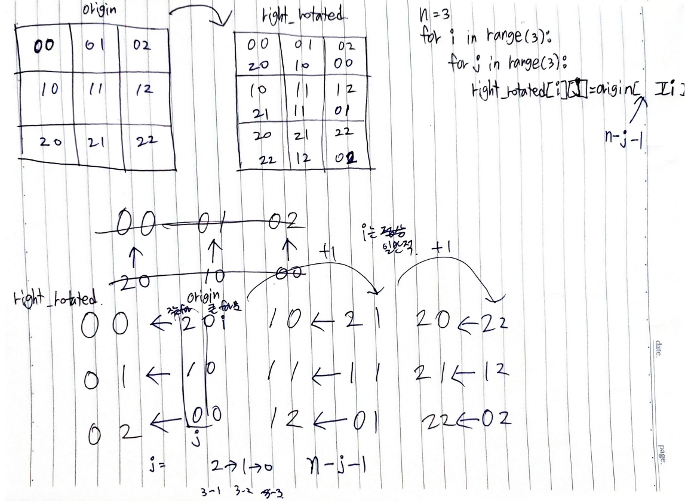

# 1. 이차원 리스트

- **리스트를 원소로 가지는 리스트**
- 이차원 리스트는 **행렬(matrix)**

## 특정 값으로 초기화 된 이차원 리스트 만들기

1. 직접 작성
   
   ```python
   matrix1 = [[0,0,0], [0,0,0], [0,0,0], [0,0,0]]
   ```

2. 반복문으로 작성(100 x 100 행렬)

```python
from pprint import pprint
matrix = []
for _ in range(100):
matrix.append([0] * 100)
print(matrix)
pprint(matrix)
```

2. 반복문으로 작성(n x m 행렬)

```python
n = 4 # 행
m = 3 # 열

matrix = []

for _ in range(n):
  matrix.append([0] * m)

print(matrix)

pprint(matrix)
```

3. 리스트 컴프리헨션
   
   ```python
   n = 4
   m = 3
   # 2번 -> 3 번으로 이해하기
   # 컴프리헨션때 (값 + 조건/반복)
   matrix = [[0] * m for _ in range(n)]
   print(matrix)
   ```

! 주의 ! 리스트 컴프리헨션 vs 리스트 곱셈 연산

```python
n = 2
m = 2

matrix1 = [[0] * m for _ in range(n)]

matrix1[0][0] = 1

matrix2 = [[0] * m] * n # martrix1 과 똑같이 나옴

matrix2[0][0] = 2

print(matrix1) #[[1,0], [0,0]]
print(matrix2) #[[1,0], [1,0]]
```



# 2. 입력 받기

1. 행렬의 크기가 미리 주어지는 경우
   
   1. 처음에는 일단 초기화 8x8를 전부 [0]으로 초기화
   
   2. 입력을 그대로 2차원 리스트화
      
      ```python
      matrix1 = []
      for _ in range(8):
      line = list(input())
      matrix1.append(line)
      matrix2 = [list(input()) for _ in range(8)]
      ```

```python
# 3 x 3 크기의 입력을 받기
# 1 2 3
# 4 5 6
# 7 8 9

matrix = []

for _ in range(3):
  n = list(map(int, input().split()))
  matrix.append(n)


matrix2 = [list(map(int, input().split())) for _ in range(3)]
```

2. 행렬의 크기가 입력으로 주어지는 경우
   
   ```python
   n, m = map(int, input().split())
   matrix = []
   for _ in range(n):
   line = list(map(int, input().split()))
   matrix.append(line)
   matrix = [list(map(int, input().split())) for _ in range(n)]
   ```

# 3. 순회
- 이차원 리스트를 단순히 출력하면 아래와 같이 나옴
```python
matrix= [
   [1,2,3,4],
   [5,6,7,8],
   [9,0,1,2]
]
```

- 인덱스를 통해 각각 출력하면 가능!
```python
matrix= [
   [1,2,3,4],
   [5,6,7,8],
   [9,0,1,2]
]

print(matrix[0][0], matrix[0][1], matrix[0][2], matrix[0][3])
print(matrix[1][0], matrix[1][1], matrix[1][2], matrix[1][3])
print(matrix[2][0], matrix[2][1], matrix[2][2], matrix[2][3])

>>> 1 2 3 4
>>> 5 6 7 8
>>> 9 0 1 2
```

1. 이중 for문을 이용한 행 우선 순회
```python
matrix= [
   [1,2,3,4],
   [5,6,7,8],
   [9,0,1,2]
]

for i in range(3): # 행
   for j in range(4): # 열
      print(matrix[i][j], end=' ')
   print()

>>> 1 2 3 4
>>> 5 6 7 8
>>> 9 0 1 2
```

2. 이중 for문을 이용한 열 우선 순회
```python
matrix= [
   [1,2,3,4],
   [5,6,7,8],
   [9,0,1,2]
]

for i in range(4): # 행
   for j in range(3): # 열
      print(matrix[j][j], end=' ')
   print()

>>> 1 5 9
>>> 2 6 0
>>> 3 7 1
>>> 4 8 2
```

3. 행 우선 순회를 이용해 이차원 리스트의 총합 구하기
```python
matrix= [
   [1,2,3,4],
   [5,6,7,8],
   [9,0,1,2]
]

total_ = 0

for i in range(3): # 행
   for j in range(4): # 열
      total_ += matrix[i][j]

print(total)
```

[참고] Pythonic한 방법으로 이차원 리스트의 총합 구하기
```python
matrix= [
   [1,2,3,4],
   [5,6,7,8],
   [9,0,1,2]
]

total_ = 0

for row in matrix:
   for elem in row:
      # print(elem, end=' ')
      total_ += elem

total_ = sum(map(sum, matrix))

print(total)
```

4. 행 우선 순회를 이용해 이차원 리스트의 최대값, 최소값 구하기
```pyhon
# 최대값
matrix= [
   [1,2,3,4],
   [5,6,7,8],
   [9,0,1,2]
]

max_value = 0

for i in range(3):
   for j in range(4):
   if matrix[i][j] > max_value:
      max_value = matrix[i][j]

print(max_value) # 10
```

```pyhon
# 최소값
matrix= [
   [1,2,3,4],
   [5,6,7,8],
   [9,0,1,2]
]

min_value = 9999999999

for i in range(3):
   for j in range(4):
   if matrix[i][j] < min_value:
      min_value = matrix[i][j]

print(max_value) # 1
```

[참고] Pythonic한 방법으로 이차원 리스트의 최대값, 최소값 구하기
```python
matrix= [
   [1,2,3,4],
   [5,6,7,8],
   [9,0,1,2]
]

max_value = max(map(max, matrix))
min_value = min(map(min, matrix))

print(max_value) # 10
print(min_value) # 1
```
# 4. 전치
- 전치(transpose) 란 행과 열을 서로 맞바꾸는 것을 의미
```python
matrix = [
   [1,2,3,4],
   [5,6,7,8],
   [9,0,1,2]
]
# 전치 행렬을 담을 이차원 리스트는 행과 열의 크기가 반대!

transposed_matrix = [[0] * 3 for _ in range(4)]

for i in range(4):
   for j in range(3):
      transposed_matrix[i][j] = matrix[j][i] # 행, 열 바꾸기

```

# 5. 회전
- 문제에서 이차원 리스트를 왼쪽, 오른쪽으로 90도 회전하는 경우가 존재




```python
# 왼쪽 회전
matrix =[
   [1,2,3],
   [4,5,6],
   [7,8,9]
]

n = 3
left_rotated = [[0] * n for _ in range(n)]

for i in range(n):
   for j in range(n):
      rotated_matrix[i][j] = matrix[j][n-i-1]
```

```python
# 오른쪽 회전
matrix =[
   [1,2,3],
   [4,5,6],
   [7,8,9]
]

n = 3
right_rotated = [[0] * n for _ in range(n)]

for i in range(n):
   for j in range(n):
      rotated_matrix[i][j] = matrix[n-j-1][i]
```