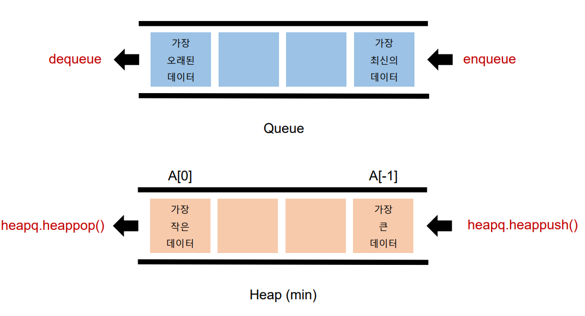

# 1. 힙(Heap)

- 일반큐는 선잆선출 방식
- 순서가 아닌 다른 기준?

## 우선순위 큐(Priority Queue)

<u>우선순위(중요도, 크기 등 순서 이외의 기준)를 기준</u>으로 가장 우선순위가 높은 데이터가 가장 먼저 나가는 방식

1. 가중치가 있는 데이터
2. 작업 스케줄링
3. 네트워크


## 우선순위 큐를 구현하는 방법

1. 배열
2. 연결 리스트
3. 힙(Heap)

## 우선순위 큐 구현 별 복잡도

| 연산 종류                   | Enqueue(추가) | Dequeue() |
| ----------------------- | ----------- | --------- |
| 배열(Array)               | O(1)        | O(N)      |
| 정렬된 배열                  | O(N)        | O(1)      |
| 연결리스트<br/>(Linked List) | O(1)        | O(N)      |
| 정렬된 연결리스트               | O(1)        | O(1)      |
| 힙                       | O(logN)     | O(logN)   |

- 막 추가하고 뺄 때 정렬을 할지
- 정렬을 하면서 추가하고 빠르게 빼낼 지

## 힙의 특징

- 최대값 또는 최소값을 빠르게 찾아내도록 만들어진 데이터구조
- 완전 이진 트리 형태로 <u>느슨한 정렬 상태를 지속적으로 유지</u>
- 힙 트리에서는 중복 값을 허용

## 언제 사용해야 할까?

1. 데이터가 지속적으로 정렬되야 하는 경우
2. 데이터에 삽입/삭제가 빈번할 때

## 파이썬의 heapq 모듈

- Minheap(최소 힙)으로 구현되어 있음(가장 작은 값이 먼저 옴)
  삽입,삭제,수정,조회 **연산의 속도가 리스트보다 빠름**
  (배열, 연결리스트, 힙으로 구현 가능)

## 힙과 리스트 비교

| 연산 종류                   | 힙       | 리스트     |
| ----------------------- | ------- | ------- |
| Get Item                | O(1)    | O(N)    |
| Insert Item             | O(N)    | O(1)    |
| 연결리스트<br/>(Linked List) | O(1)    | O(N)    |
| 정렬된 연결리스트               | O(1)    | O(1)    |
| 힙                       | O(logN) | O(logN) |

## 큐와 힙의 사용법 비교



## 메서드

1. heapq.heapify() 힙으로 만들어줌, 원본을 바꿈
2. heapq.heappop(heap)
3. heapq.heappush(heap, item)

```python
import heapq

numbers= [5,3,2,4,1]

heapq.heapify(numbers)
# print(numbers) # [1,3,2,4,5]
heapq.heappop(numbers)
print(numbers) # [2,3,5,4]
heapq.heappop(numbers)
print(numbers) # [3,4,5]
heapq.heappush(numbers, 10)
print(numbers) # [3,4,5,10]
heapq.heappush(numbers, 0)
print(numbers) # [0,3,5,10,4]
```

## 힙 문제

- 백준 1927
  
  ```python
  import heapq
  # numbers = [0,12345678,1,2,0,0,0,0,32]
  heap = [] # heapq.heapify(heap) # heapify 하지 않아도 정렬, 삽입하는 과정에서 실행됨
  
  N = int(input())
  for _ in range(N):
      n = int(input())
      if n != 0:
          heapq.heappush(heap, n)   
      else:
          if len(heap) == 0 : 
              print(0)
          else:
              heapq.heappop(heap)
  ```

# 2. 셋(Set)

- 셋은 수학에서의 '집합'을 나타내는 데이터 구조

## 셋의 연산

1. .add()
2. .remove()
3. +(합)
4. -(차)
5. &(교)
6. ^(대칭차)

## set은 언제 사용해야할까?

1. 데이터의 중복이 없어야 할 때(고유값들로 이루어진 데이터가 필요할때)
2. 정수가 아닌 데이터의 삽입/삭제/탐색이 빈번히 필요할때

## 셋 연산의 시간 복잡도

| 연산 종류  | 시간복잡도 |
| ------ | ----- |
| 탐색     | O(1)  |
| 제거     | O(1)  |
| 합집합    | O(N)  |
| 교집합    | O(N)  |
| 차집합    | O(N)  |
| 대칭 차집합 | O(N)  |

## 셋 연습

백준 14425

```python
S = ['baekjoononlinejudge','startlink','codeplus','sundaycoding','codingsh']

words = ['backjoon', 'codeplus', 'codeminus','startlink','starlink','sundaycoding','codingsh','codinghs','sondaycoding','startrink','icerink']


# 풀이 1
cnt = 0

word_set = set(S) # 미리 설정해야

for word in words:
  if word in word_set: # # set()함수를 반복하지 않을 수 있음
  # if word in S: # if word in set(S) 둘의 시간 차이가 실제로 날까?
    cnt += 1
print(cnt)

# 풀이 2
print(len(set(words) & set(S)))
```