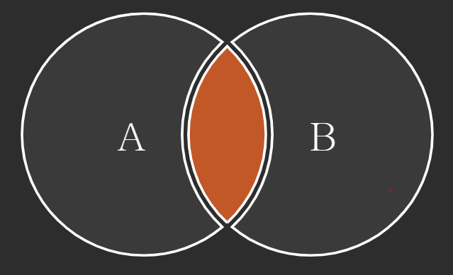
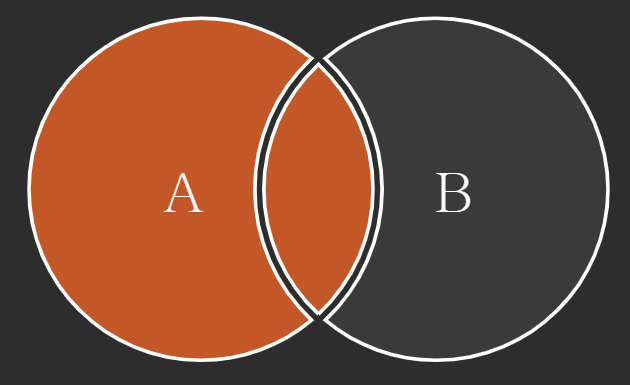
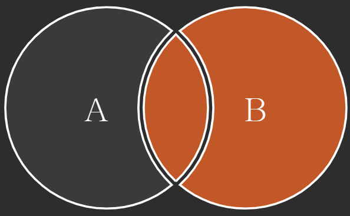
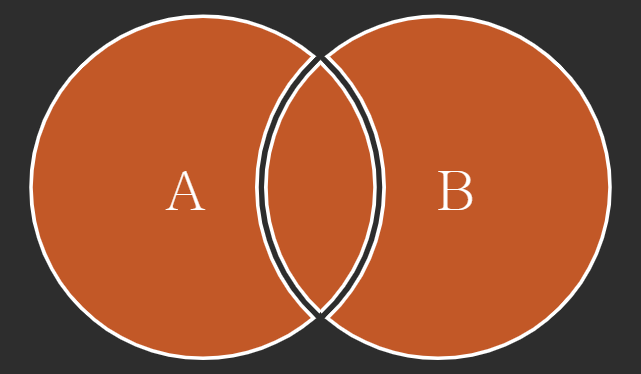

# JOIN

- 관계형 데이터베이스의 가장 큰 장점이자 핵심적인 기능
- 일반적으로 데이터베이스에는 하나의 테이블에 많은 데이터를 저장하는 것이 아니라 여러 테이블로 나눠 저장하게 되며, 여러 테이블을 결합(Join)하여 출력하여 활용
- 일반적으로 레코드는 기본키(PK)나 외래키(FK) 값의 관계에 의해 결합함

## 대표적인 JOIN

- INNER JOIN : 두 테이블에 모두 일치하는 행만 반환
- OUTER JOIN : 동일한 값이 없는 행도 반호나
- CROSS JOIN : 모든 데이터의 조합

### INNER JOIN : 조건에 일치하는(동일한 값이 있는) 행만 반환

```sql
SELECT *
FROM 테이블1 [INNER] JOIN 테이블2
    ON 테이블1.칼럼 = 테이블2.칼럼
```



ex1) 사용자(users)와 각각의 역할을 출력

```sql
SELECT *
FROM users INNER JOIN role
ON users.role_id = role.id;
```

ex2) staff(2) 사용자(users)를 역할과 함께 출력

```
SELECT *
FROM users INNER JOIN role
ON users.role_id = role.id
WHERE role.id = 2;
```

### OUTER JOIN : 동일한 값이 없는 데이터도 반환할 때 사용

- 기준이 되는 테이블에 따라 LEFT/RIGHT/FULL 지정
  
  ```sql
  SELECT *
  FROM 테이블1 [LEFT | RIGHT | FULL} OUTER JOIN 테이블2
  ON 테이블1.칼럼 = 테이블2.칼럼;
  ```





ex1) 모든 게시글을 사용자 정보와 함께 출력

```sql
SELECT *
FROM articles LEFT OUTER JOIN users
ON = user.id = articles.users.id;
```

ex2) 작성자가 있는 모든 게시글을 사용자 정보와 함께 출력

```sql
SELECT *
FROM articles LEFT OUTER JOIN users
  ON users.id = articles.user_id
WHERE articles.user_id IS NOT NULL;
```

ex3) 모든 게시글과 모든 사용자 정보 출력

```sql
SELECT *
FROM articles FULL OUTER JOIN users
    ON users.id = articles.user_id;
```

### CROSS JOIN : 모든 가능한 경우의 수의 Join

```sql
SELECT *
FROM 테이블1 CROSS JOIN 테이블2;
```

ex1) users와 role의 CROSS JOIN 결과를 출력

```sql
SELECT *
FROM users CROSS JOIN role;
```