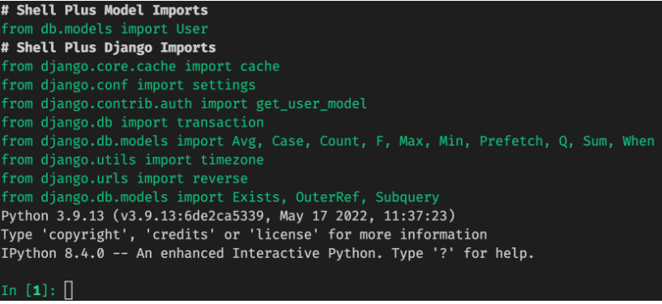
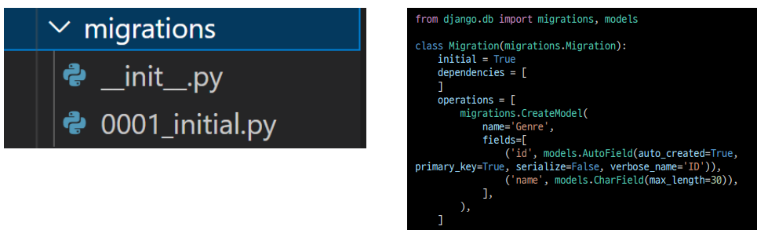
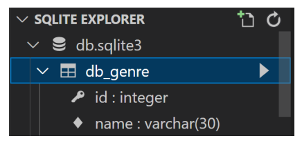
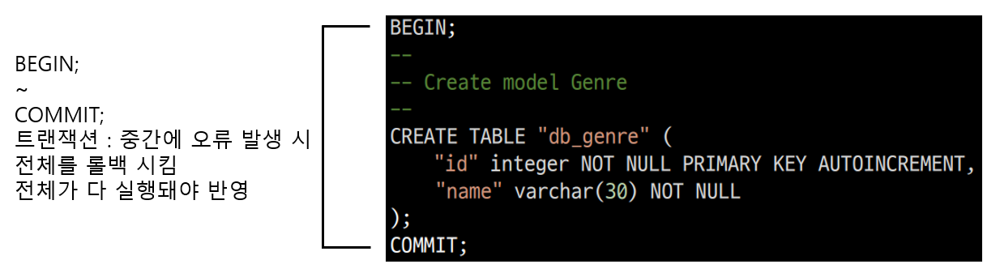
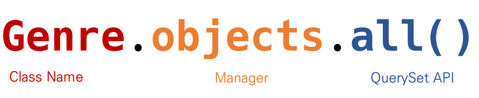

# 실습 환경 설정

- vscode의 터미널에서 실행

## 가상환경

- 생성

```python
python -m venv venv
```

- 실행

```python
. venv/Scripts/activate
```

- (venv) 확인

## 패키지 설치(한 번만 진행)

```python
pip install -r requirements.txt
```

```python
python manage.py --version
```

## 모델 마이그레이션

```python
python manage.py makemigrations

python manage.py migrate
```

## django shell

- shell 진입

```python
python manage.py shell_plus
```



## 파일 실행

- 가상환경을 실행한 상태인지 꼭 확인할 것!!

```python
python main.py
```

# ORM

- Object-Relational-Mapping
- 객체 지향 프로그래밍 언어를 사용하여 호환되지 않는 유형의 시스템 간의 데이터를 변환하는 프로그래밍 기술
- 파이썬에는 SQLAlchemy, peewee 등 라이브러리가 있음
- Django 프레임워크에서는 내장 Django ORM을 활용
- 객체로 DB를 조작한다.

```python
Genre.objects.all()
```

## 모델 설계 및 반영

1. 클래스를 생성하여 내가 원하는 DB의 구조를 만든다.

| name | Genre     |
| ---- | --------- |
| pk   | <u>id</u> |
|      | name      |

```python
class Genre(models.Model):
    name = models.CharField(max_length = 30)
```

2. 클래스의 내용으로 데이터베이스에 반영하기 위한 마이그레이션 파일을 생성한다.

```python
$ python manage.py makemigrations
```



3. DB에 migrate 한다.

```sql
$ python manage.py migrate
```



### Migration(마이그레이션)

- Model에 생긴 변화를 DB에 반영하기 위한 방법

- 마이그레이션 파일을 만들어 DB 스키마를 반영한다.

- 명령어
  
  - makemigrations : 마이그레이션 파일 생성
  
  - migrate : 마이그레이션을 DB에 반영

## Migrate 살펴보기



## 데이터 베이스 조작(Database API)



# ORM 기본조작

## CREATE

```python
# 1. create 메서드 활용
Genre.objects.create(name='발라드')

# 2. 인스턴스 조작
genre = Genre()
genre.name = '인디밴드'
genre.save()
```

## READ

```python
# 1. 전체 데이터 조회
Genre.objects.all()

# 2. 일부 데이터 조회(get)
# 값이 없으면 에러 발생. PK를 불러올 때 주로 사용
Genre.objects.get(id=1)

# 3. 일부 데이터 조회(filter)
# 값이 없어도 실행
Genre.objects.filter(id=1)
```

## Update

```python
# 1. genre 객체 활용
genre = Genre.objects.get(id=1)

# 2. genre.name = '트로트'
genre.name = '트로트'
# 3. genre 객체 저장
genre.save()
```

## Delete

```python
# 1. genre 객체 활용
genre = Genre.objects.get(id=1)

# 2. genre 객체 삭제
genre.delete()
```
