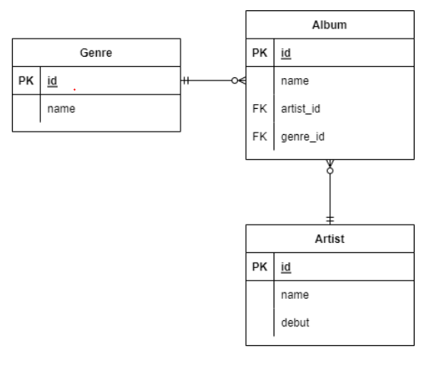
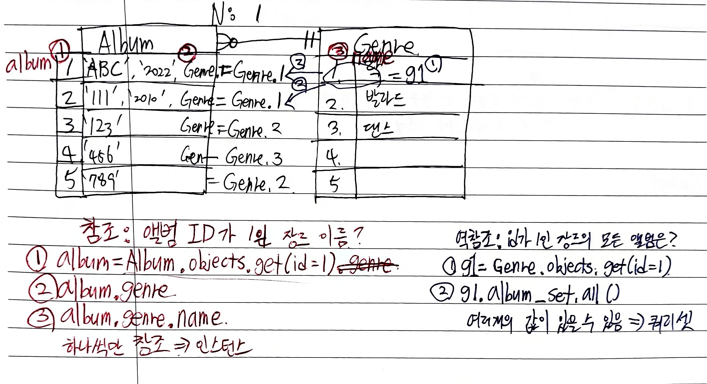

# QuerySet API

## gt(greater than)

- 초과
  
  ```python
  Entry.objects.filter(id__gt=4)
  ```
  
  ```SQL
  SELECT ... WHERE id > 4;
  ```

### gte(greater than equal)

- 이상
  
  ```python
  Entry.objects.filter(id__gte=4)
  ```
  
  ```SQL
  SELECT ... WHERE id >= 4;
  ```

### lt, lte

- 미만, 이하
  
  ```python
  Entry.objects.filter(id__lt=4)
  Entry.objects.filter(id__lte=4)
  ```
  
  ```SQL
  SELECT ... WHERE id < 4;
  SELECT ... WHERE id <= 4;
  ```

### in

- 포함
  
  ```python
  Entry.objects.filter(id__ln=[1,3,4])
  Entry.objects.filter(headline__in='abc')
  ```
  
  ```SQL
  SELECT ... WHERE id IN (1,3,4);
  SELECT ... WHERE headline IN ('a','b','c');
  ```

### startswith

- 시작하는 문자열
  
  ```python
  Entry.objects.filter(headline__startswith='Lennon')
  ```
  
  ```SQL
  SELECT ... WHERE headline LIKE 'Lennon%';
  ```

### istartswith

- 대소문자 구분 x
  
  ```python
  Entry.objects.filter(headline__istartswith='Lennon')
  ```
  
  ```SQL
  SELECT ... WHERE headline ILIKE 'Lennon%';
  ```
  
  ### endswith
  
  ```python
  Entry.objects.filter(headline__endswith='Lennon')
  Entry.objects.filter(headline__iendswith='Lennon')
  ```
  
  ```SQL
  SELECT ... WHERE headline LIKE '%Lennon';
  SELECT ... WHERE headline ILIKE '%Lennon';
  ```

### contains

```python
Entry.objects.filter(headline__contains='Lennon')
Entry.objects.filter(headline__icontains='Lennon')
```

```SQL
SELECT ... WHERE headline LIKE '%Lennon%';
SELECT ... WHERE headline LIKE '%Lennon%';
```

### range

```python
import datetime
start_date = datetime.date(2005, 1, 1)
end_date = datetime.date(2005, 3, 31)
Entry.objects.filter(pub_date__range=(start_date, end_date)
```

```SQL
SELECT ... WHERE pub_date
BETWEEN '2005-01-01' and '2005-03-31';
```

### 복합 활용

```python
inner_qs = Blog.objects.filter(name__contains='Cheddar')
entries = Entry.objects.filter(blog__in = inner_qs)
```

```SQL
SELECT ...
WHERE blog.id IN (SELECT id FROM ... WHERE NAME
LIKE '%Cheddar%')
```

### 활용

```python
Entry.objects.all()[0]
```

```SQL
SELECT ...
LIMIT 1;
```

```python
Entry.objects.all()[n,m]
```

```SQL
LIMIT N OFFSET M
```

```python
Entry.objects.order_by('id')
```

```SQL
SELECT ...
ORDER BY id;
```

```python
Entry.objects.order_by('-id')
```

```SQL
SELECT ...
ORDER BY id DESC;
```

# ORM 확장(1:N)

- 모델링(ORM)



```python
class Genre(models.Model):
  name = models.CharField(max_length=30)

class Artist(models.Model):
  name = models.CharField(max_length=30)
  debut = models.DateField()

class Album(models.Model):
  name = models.CharField(max_length=30)
  genre = models.ForeignKey('Genre', on_delete=models.CASCADE)
  artist = models.ForeignKey('Artist', on_delete=models.CASCADE)
```

## Foreign Key(외래키)

- 키를 사용하여 부모 테이블의 유일한 값을 참조 (참조 무결성)
  - 데이터베이스 관계 모델에서 관련된 2개의 테이블 간의 일관성
- 외래 키의 값이 반드시 부모 테이블의 기본 키일 필요는 없지만 유일한 값이어야 함

## models.ForeignKey 필드

- 2개의 필수 위치 인자
  - Model class : 참조하는 모델
  - on_delete : 외래키가 참조하는 객체가 삭제되었을 때 처리 방식
    - CASCADE : 부모 객체(참조 된 객체)가 삭제 됐을 때 이를 참조하는 객체도 삭제
    - PROTECT : 삭제되지 않음
    - SET_NULL : NULL 설정
    - SET_DEFAULT : 기본 값 설정

## Create

```python
artist = Artist.objects.get(id=1)
genre = Genre.objects.get(id=1)

album = Album()
album.name = '앨범1'
album.artist = artist # 1. 객체의 저장
album.genre = genre
album.save()
```

## 참조와 역참조



```python
# 1. 참조
album = Album.objects.get(id=1)
album.artist
# <Artist: Artist object (1)>
album.genre
# <Genre: Genre object(1)>
# album.name처럼 그냥 사용한다. 


# 2. 역참조
genre = Genre.objects.get(id=1)
genre.album_set.all()
# <QuerySet [<Album: Album object (1)>, <Album:Album object (2)>]>
# albums의 인스턴스가 담긴 쿼리셋
# 1:N의 관계이므로 N개가 있을 수 있기 때문에 쿼리셋으로 반환
# 트로트인 앨범들 : 쿼리셋
# 앨범의 장르 : 인스턴스
```

- QuerySet에서 .query(ex Genre.objects.all().query, Genre.objects.order_by('-id').query)를 하면 query문을 확인할 수 있음

- A를 forign key로 하면 A_id가 추가된다.

- migrations를 하다 오타로 에러가 난 경우
  .py 파일을 지우기.

---

1: N 관계에서의 Create

```python
# 객체
# Class 정의를 genre로 했기 때문
album = Album()
album.name = '꽃'
# ablum.genre = 1
# ValueError : Cannot assign "1" : "Album.genre" must be a "Genre" instance.
genre = Genre.objects.get(id=1)
album.genre = genre
album.artist = Artist.objects.get(id=1)
album.save()

# 값
# 테이블에 실제 필드는 _id가 붙어있기 때문
album = Album()
album.genre_id = 1
album.artist_id = 1
album.name = '미아'
album.save()


# N => 1 (참조)
# 앨범의 id가 1인 것의
album = Album.objects.get(id=1) # 앨범 객체
# 장르의 이름은?
album.genre # 장르 객체
# <Genre : Genre object (1)>
album.genre.name
# '발라드'

# 1 => N (역참조)
# id가 1인 장르의 모든 앨범은?
g1 = Genre.objects.get(id=1)
g1.album_set.all() # 역참조시 소문자_set 으로 
# <QuerySet [<Album: Album object (1)>, <Album: Album object (2)>]>
```