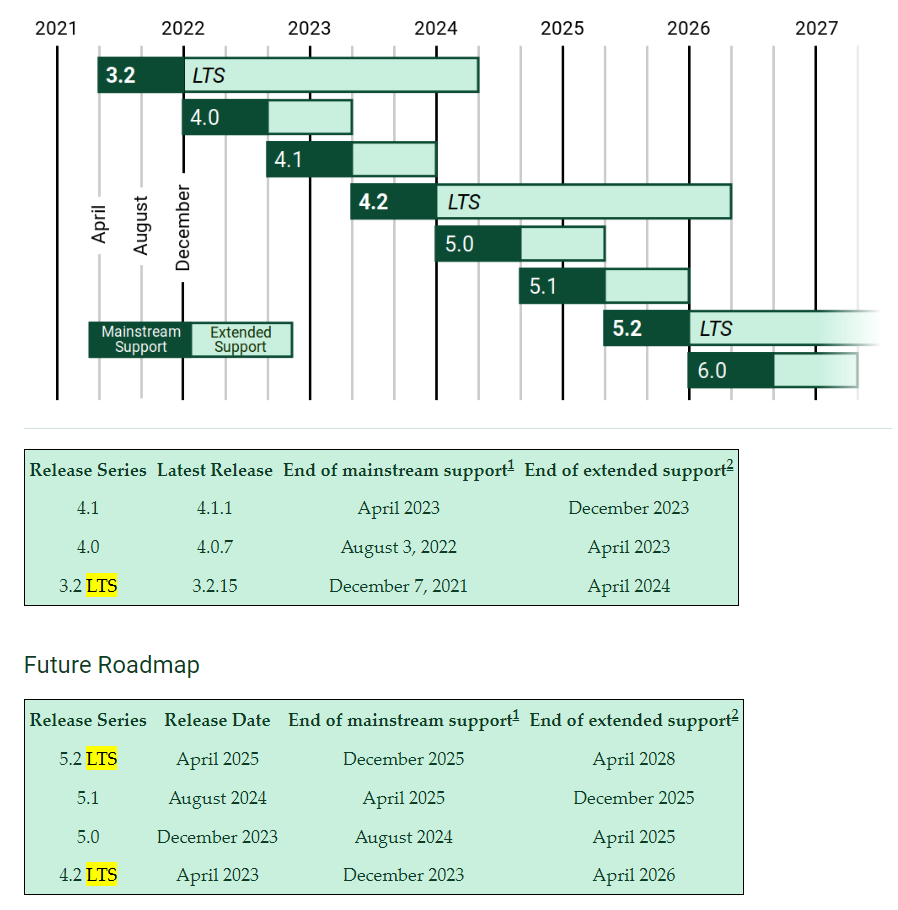
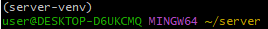
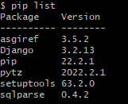
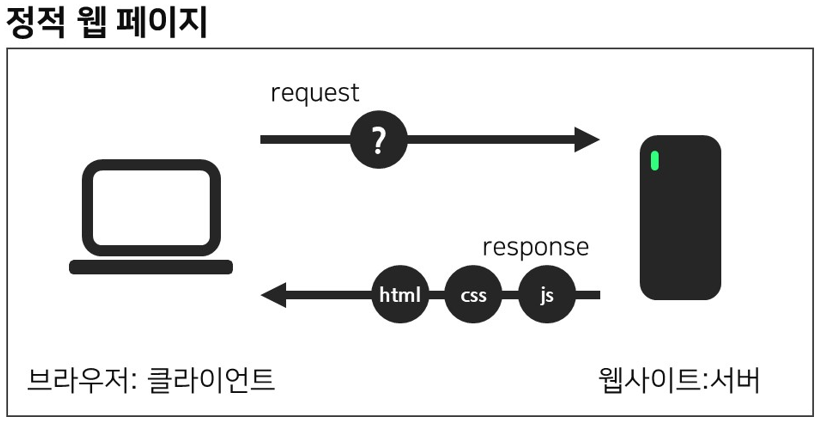
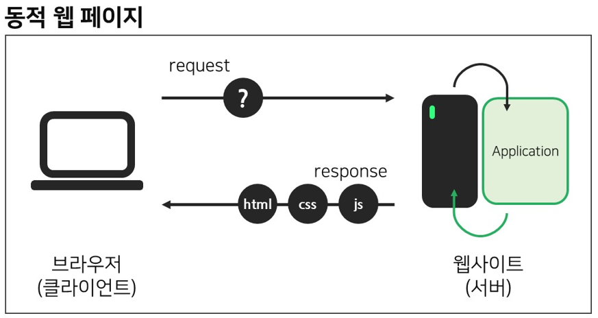

# Django 시작

## Framework 이해

- 누군가 만들어 놓은 코드를 재사용하는 것은 익숙한 개발 문화

- '웹 서비스'도 

- 서비스 개발에 필요한 기능들을 미리 구현해서 모아 놓은 것 = 프레임워크(Framework)

- Frame(뼈대, 틀) + Work(일하다)
  
  - 일정한 뼈대, 틀을 가지고 일하다
  
  - 제공받은 도구들과 뼈대, 규약을 가지고 무언가를 만드는 일
  
  - 특정 프로그램을 개발하기 위한 여러 도구들과 규약을 제공하는 것

- "소프트웨어 프레임워크"

## Django를 배워야하는 이유

- python으로 작성된 프레임워크
  
  - python이라는 언어의 강력함과 거대한 커뮤니티

- 수많은 여러 유용한 기능들

- 검증된 웹 프레임워크
  
  - 화해, Toss, 두나무, 당근 마켓, 요기요 등
  
  - 유명한 많은 서비스들이 사용한다는 것 == 안정적으로 서비스를 할 수 있다는 검증

## Web 이해하기

### WWW(World Wide Web)

- 인터넷
  
  - 우리가 구글에 접속할 때
    
    - 웹 브라우저를 켠다
    
    - 주소창에 주소를 입력한다(www.google.com)
  
  - www, 즉 World Wide Web은 '전 세계에 퍼져 있는 거미줄 같은 연결망'

## 클라이언트와 서버

- 서비스 : 요청(클라이언트) -> 응답(서버)

- 오늘날 우리가 사용하는 대부분의 웹 서비스는 클라이언트-서버 구조를 기반으로 동작

- 클라이언트와 서버 역시 하나의 컴퓨터이며 이들이 어떻게 상호자용하는지에 대한 간소화된 다이어그램은 다음과 같음

### 클라이언트-서버 구조

- 클라이언트
  
  - 

- 서버

## Web brower와 Web page

### 웹 브라우저

- 설명 추가!

### 웹 페이지

- 웹에 있는 문서
  
  - 우리가 보는 화면 각각 한 장 한 장이 웹 페이지

#### 정적 웹 페이지

- 모든 사용자에게 똑같은 화면 공유

#### 동적 웹 페이지

- 사용자마다 띄워주는 화면이 다름

## 가상환경 생성 & 실행

1. 가상환경 생성용 폴더 준비(git bash 이용)

> mkdir [폴더명]
> 
> cd [폴더명]
> 
> python --version # 파이썬 버전 체크

2. 가상환경 생성

> python -m venv [가상환경 이름]
> 
> ls -a # 생성 확인  ./../ [가상환경 이름]/

3. Script 파일 실행

> source [가상환경 이름]/Script/activate
> 
> #만약 가상환경이 생성된 폴더와 같은 곳에 있다면 Script/activate로 실행!

## Django LTS 버전 설치

- Django LTS?
  
  - Long-Term supoort releases로 장기지원 되는 버전
  
  - 일반적으로 3년 정도 지원
  
  - [장고 다운로드]([Download Django | Django](https://www.djangoproject.com/download/))에서 확인 가능

4. Django LTS 버전 설치

> pip install django==3.2.13
> 
> 설치 완료 후
> 
> 1. [가상환경 이름]
>    user@sdffdsjklja 터미널 창에서 확인
>    
>    
> 
> 2. pip list에서 Django 확인
>    
>    

## 

## Django 프로젝트 생성

6. Django 프로젝트 생성

> django-admin startproject [프로젝트명][시작경로] 
> 
> ex) django-admin startproject firstpjt . #시작경로 .은 현재폴더

## Django 실행

7. Django 실행

> code . # 현재 폴더의 vs code 실행

> python manage.py runserver # Django 실행

> http://localhost:8000/ #브라우저 창에 본인 서버로 확인

## 서버 기초

### Q. IP와 도메인?

1. IP
   
   - 네트워크로 연결된 모든 컴퓨터에는 고유한 주소인, 점으로 구분 된 네 개의 숫자로 구성된 IP(Internet Protocol) 주소
   
   - 예: `192.168.2.10`

2. 도메인
   
   - 컴퓨터는 IP 주소로 다른 컴퓨터를 찾아가는데 문제가 없지만, 사람들은 IP주소를 기억하기 어려움. 
   
   - '도메인 이름' 이라고하는 사람이 읽을 수 있는 IP 주소의 이름을 지정함
   
   - 예: `'google.com'`은 IP 주소로 `'173.194.121.32'`

### Q. 클라이언트와 서버?

- 웹에 연결된 컴퓨터는 클라이언트와 서버라고 불림
1. 클라이언트
   
   -  일반적인 웹 사용자의 인터넷이 연결된 장치들과 이런 장치들에서 이용가능한 웹에 접근하는 소프트웨어

2. 서버
   
   - 웹페이지, 사이트, 또는 앱을 저장하는 컴퓨터
   
   - 하드웨어 측면
     
     - web server의 소프트웨어와 website의 컴포넌트 파일들을 저장하는 컴퓨터
   
   - 소프트웨어 측면
     
     - 기본적으로 웹 사용자가 어떻게 호스트 파일들에 접근하는지를 관리

#### 브라우저에 웹 주소를 입력할 때의 예시

- 웹은 도로, 도로의 한 쪽 끝은 우리의 집인 클라이언트, 다른 한 쪽은 상점인 서버
1. 브라우저는 DNS 서버로 가서 웹사이트가 있는 서버의 진짜 주소를 찾음 (여러분이 상점의 주소를 찾음).

2. 그 다음 브라우저는 서버에게 웹사이트의 사본을 클라이언트에게 보내달라는 HTTP 요청 메세지를 서버로 전송(상점으로 가서 상품을 주문) 이 메세지, 그리고 클라이언트와 서버 사이에 전송된 모든 데이터는 TCP/IP 연결을 통해서 전송됨

3. 이 메세지를 받은 서버는 클라이언트의 요청을 승인하고, "200 OK" 메세지를 클라이언트에게 전송. "200 OK"는 "물론이죠. 당신은 웹 사이트를 볼 수 있어요! 여기 있어요" 라는 의미. 그 다음 서버는 웹사이트의 파일들을 데이터 패킷이라 불리는 작은 일련의 덩어리들로 브라우저에 전송하기 시작.(상점은 여러분이 주문한 상품을 전달하고, 여러분은 그것을 집으로 가져감.)

4. 브라우저는 이 작은 덩어리들을 완전한 웹 사이트로 조립하고, 당신에게 보여줌. (상품이 당신의 문에 도착함. — 새 것이죠, 멋져요!)
+ 추가 설명
  
  - **인터넷 연결**: 여러분이 웹에서 데이터를 보내고 받을 수 있게 해줌. 기본적으로 여러분의 집과 상점 사이의 거리와 같습니다.
  - **TCP/IP**: Transmission Control Protocol (전송 제어 규약) 과 Internet Protocol (인터넷 규약) 은 데이터가 어떻게 웹을 건너 여행해야 하는지 정의하는 통신 규약. 주문을 하고, 상점에 가고, 또 여러분의 상품을 살 수 있게 해주는 운송 장치와 같음. 예시에서, 이것은 차 또는 자전거 (또는 여러분의 두 다리) 와 같음.
  - **DNS**: Domain Name System Servers (도메인 이름 시스템 서버) 는 웹사이트를 위한 주소록과 같음. 여러분이 브라우저에 웹 주소를 입력할 때, 브라우저는 그 웹사이트를 검색하기 전에 DNS 를 살펴봄. 브라우저는 HTTP 메시지를 올바른 장소로 전송하기 위해 그 웹사이트가 있는 서버가 어떤것인지 찾아야 함. 이것은 여러분이 접근하기 위해 상점의 주소를 찾아보는 것과 같음
  - **HTTP**: Hypertext Transfer Protocol (하이퍼텍스트 전송 규약) 은 클라이언트와 서버가 서로 통신할 수 있게 하기 위한 언어를 정의하는 어플리케이션 규약. 이것은 여러분의 상품을 주문하기 위해 여러분이 사용하는 언어와 같음.
  - **컴포넌트 파일**: 한 웹사이트는 여러분이 상점에서 사는 다양한 종류의 상품들과 같이 많은 다른 파일들로 만들어짐.
    - **코드 파일**: 웹사이트는 근본적으로 HTML, CSS, 그리고 JavaScript 로 생성
    - **자원**: 이것은 이미지, 음악, 비디오, 단어 문서, 그리고 PDF 같은, 웹사이트를 만드는 모든 다른 것들을 위한 공동적인 이름

### Q. 정적 웹 사이트 VS 동적 웹 사이트

- 정적 웹 사이트
  
  - 정적 사이트는 특별한 리소스 요청이 들어올 때 서버에서 하드 코딩된 동일한 콘텐츠를 반환.
  
  - 사용자가 페이지를 탐색하거나, 브라우저가 지정된 URL에 HTTP "GET"요청을 보낼 때 서버는 파일 시스템에서 요청한 문서를 검색하고 문서와 [success status](https://developer.mozilla.org/ko/docs/Web/HTTP/Status#successful_responses) (보통 200 OK)를 포함한 HTTP응답을 반환
    
    

- 동적 웹 사이트
  
  - 동적 웹 사이트는 필요할 때에 동적으로 응답 콘텐츠가 생성
  
  - 동적 웹사이트의 웹 페이지는 보통 HTML 템플릿에 있는 자리 표시자에 데이터베이스에서 가져온 데이터를 넣어 생성 
  
  - 동적 웹사이트는 사용자또는 저장된 환경을 기반으로 URL에 대해 다른 데이터를 반환 할 수 있으며, 응답을 반환하는 과정에서 다른 작업을 수행 할 수 있음
    
    

- Django
  
  - 보안이 우수하고 유지보수가 편리한 웹사이트를 신속하게 개발하는 하도록 도움을 주는 파이썬 웹 프레임워크

### HTTP?

- **HTTP 문서와 같은 리소스들을 가져올 수 있도록 해주는** 프로토콜*
  
  - 프로토콜* : 컴퓨터 내부 혹은 컴퓨터 사이에서 데이터의 교환 방식을 정의하는 규칙

- HTTP은 클라이언트-서버 프로토콜이기도 함

- 클라이언트-서버 프로토콜 : 수신자 측에 의해 요청이 초기화되는 프로토콜을 의미

- 클라이언트와 서버들은 개별적인 메시지 교환에 의해 통신
  
  - 요청(requests): 브라우저인 클라이언트에 의해 전송되는 메시지
  
  - 응답(responses) : 서버에서 응답으로 전송되는 메시지
    
    
    
         

### HTTP 메시지?

- 요청
  
  
  - HTTP 메서드 : 보통 클라이언트가 수행하고자 하는 동작을 정의한 GET, POST 같은 동사나 OPTIONS나 HEAD와 같은 명사
    
    - 일반적으로, 클라이언트는 리소스를 가져오거나(GET을 사용하여) HTML 폼의 데이터를 전송(POST를 사용하여)하려고 하지만, 다른 경우에는 다른 동작이 요구될 수도 있음.
  
  - 가져오려는 리소스의 경로; 예를 들면 프로토콜 (http://), 도메인 (en-US) (여기서는 developer.mozilla.org), 또는 TCP 포트 (en-US) (여기서는 80)인 요소들을 제거한 리소스의 URL
  
  - HTTP 프로토콜의 버전.
  
  - 서버에 대한 추가 정보를 전달하는 선택적 헤더들.
  
  - POST와 같은 몇 가지 메서드를 위한, 전송된 리소스를 포함하는 응답의 본문과 유사한 본문.

- 응답
  
  
  - HTTP 프로토콜의 버전.
    - 요청의 성공 여부와, 그 이유를 나타내는 상태 코드.
    - 아무런 영향력이 없는, 상태 코드의 짧은 설명을 나타내는 상태 메시지.
    - 요청 헤더와 비슷한, HTTP 헤더들.
    - 선택 사항으로, 가져온 리소스가 포함되는 본문.

### 프레임워크?

- 소프트웨어의 구체적인 부분에 해당하는 설계와 구현을 재사용이 가능하게끔 일련의 협업화된 형태로 클래스들을 제공하는 것
