## 요청과 응답

- URL -> VIEW -> TEMPLATE 순의  작성 순서로 코드를 작성해보고 데이터의 흐름을 이해하기

### URLs

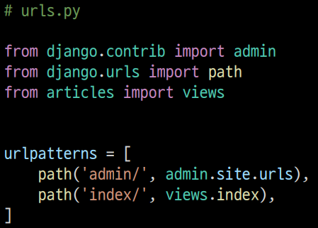

### Views

- HTTP 요청을 수신하고 HTTP 응답을 반환하는 함수 작성

- Template에게 HTTP 응답 서식을 맡김

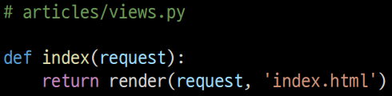

#### render()

- 주어진 템플릿을 주어진 컨텍스트 데이터와 결합하고 렌더링된 텍스트와 함께 HttpResponse(응답) 객체를 반환하는 함수

- request
  
  - 응답을 생성하는 데 사용되는 요청 객체

- template_name
  
  - 템플릿의 전체 이름 또는 템플릿 이름의 경로

- context
  
  - 템플릿에서 사용할 데이터 (딕녀너리 타입으로 작성)

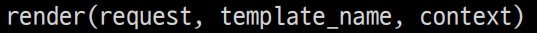

### Templates

- 실제 내용을 보여주는데 사용되는 파일

- 파일의 구조나 레이아웃을 정의

- Template 파일의 기본 경로
  
  - app 폴더 안의 templates 폴더
  
  - app_name/templates/

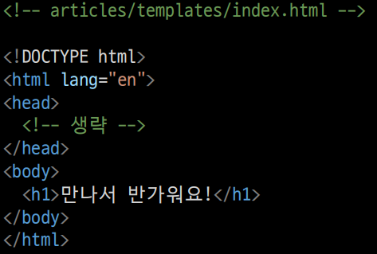

- 템플릿 폴더 이름은 반드시 templates라고 지정해야 함

### 코드 작성 순서

- Django에서의 코드 작성은 URL → View → Template 순으로 작성
  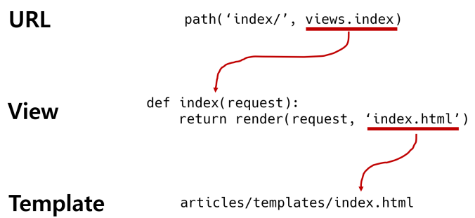

## Django Template

- “데이터 표현을 제어하는 도구이자 표현에 관련된 로직”

- Django Template을 이용한 HTML 정적 부분과 동적 컨텐츠 삽입
  
  - Template System의 기본 목표를 숙지
  
  - Django Template System
  
  - 데이터 표현을 제어하는 도구이자 표현에 관련된 로직을 담당

## Django Template Language (DTL)

- Django template에서 사용하는 built-in template system

- 조건, 반복, 변수 치환, 필터 등의 기능을 제공
  
  - Python처럼 일부 프로그래밍 구조(if, for 등)를 사용할 수 있지만 Python 코드로 실행되는 것이 아님
  
  - Django 템플릿 시스템은 단순히 Python이 HTML에 포함 된 것이 아니니 주의

- 프로그래밍적 로직이 아니라 프레젠테이션을 표현하기 위한 것임을 명심할 것

### DTL Syntax

#### Variable

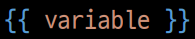

- 변수명은 영어, 숫자와 밑줄(_)의 조합으로 구성될 수 있으나 밑줄로는 시작 할 수 없음
  
  - 공백이나 구두점 문자 또한 사용할 수 없음

- dot(.)를 사용하여 변수 속성에 접근할 수 있음

- render()의 세번째 인자로 {'key': value} 와 같이 딕셔너리 형태로 넘겨주며, 여기서 정의한 key에 해당하는 문자열이 template에서 사용 가능한 변수명이 됨

#### Filters

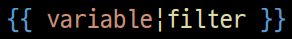

- 표시할 변수를 수정할 때 사용

- 예시)
  
  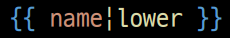
  
  - name 변수를 모두 소문자로 출력

- 60개의 built-in template filters를 제공

- chained가 가능하며 일부 필터는 인자를 받기도 함
  
    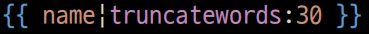

#### Tags

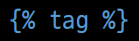

- 출력 텍스트를 만들거나, 반복 또는 논리를 수행하여 제어 흐름을 만드는 등 변수보다 복잡한 일들을 수행
- 일부 태그는 시작과 종료 태그가 필요 
  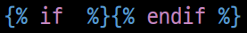
- 약 24개의 built-in template tags를 제공

#### Comments

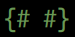

- Django template에서 라인의 주석을 표현하기 위해 사용

- 한 줄 주석에만 사용할 수 있음 (줄 바꿈이 허용되지 않음)

- 여러 줄 주석은 와  사이에 입력
  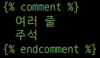
