## Variable routing

- URL 주소를 변수로 사용하는 것을 의미

- URL의 일부를 변수로 사용하여 view 함수의 인자로 넘길 수 있음

- 즉, 변수 값에 따라 하나의 path()에 여러 페이지를 연결 시킬 수 있음

### Variable routing 작성

- 변수는 “<>”에 정의하며 view 함수의 인자로 할당됨

- 기본 타입은 string이며 5가지 타입으로 명시할 수 있음
1. str
   
   - '/'를 제외하고 비어 있지 않은 모든 문자열
   
   - 작성하지 않을 경우 기본 값

2. int
   
   - 0 또는 양의 정수와 매치

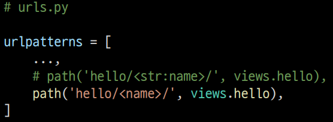

### View 함수 작성

- variable routing으로 할당된 변수를 인자로 받고 템플릿 변수로 사용할 수 있음

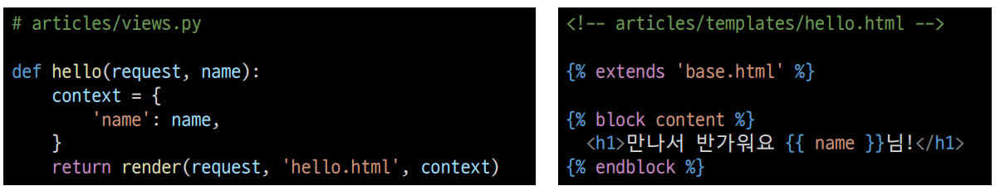

## Template Inheritance

### 템플릿 상속

- 템플릿 상속은 기본적으로 코드의 재사용성에 초점을 맞춤

- 템플릿 상속을 사용하면 사이트의 모든 공통 요소를 포함하고, 하위 템플릿이 재정의(override) 할 수 있는 블록을 정의하는 기본 ‘skeleton’ 템플릿을 만들 수 있음

- 만약 모든 템플릿에 부트스트랩을 적용하려면 어떻게 해야 할까?
  
  - 모든 템플릿에 부트스트랩 CDN을 작성해야 할까?

### 템플릿 상속에 관련된 태그

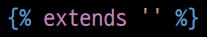

- 자식(하위)템플릿이 부모 템플릿을 확장한다는 것을 알림

- 반드시 템플릿 최상단에 작성 되어야 함 (즉, 2개 이상 사용할 수 없음)
  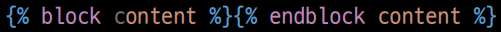

- 하위 템플릿에서 재지정(overridden)할 수 있는 블록을 정의

- 즉, 하위 템플릿이 채울 수 있는 공간

- 가독성을 높이기 위해 선택적으로 endblock 태그에 이름을 지정할 수 있음

### 템플릿 상속 예시

- base라는 이름의 skeleton 템플릿 작성

- Bootstrap CDN 작성
  
  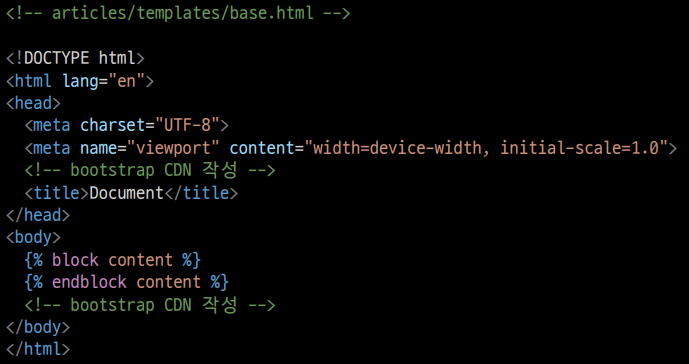

- index 템플릿에서 base 템플릿을 상속받음

- Bootstrap이 적용되었는지 확인

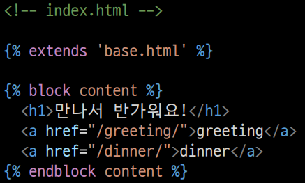

## Sending and Retrieving form data

- "데이터를 보내고 가져오기"

- HTML form element를 통해 사용자와 애플리케이션 간의 상호작용 이해하기
  
  - 웹은 기본적으로 클라이언트-서버 아키텍처를 사용
    
    - 클라이언트(일반적으로 웹 브라우저)가 서버에 요청을 보내고, 서버는 클라이언트의 요청에 응답
  
  - 클라이언트 측에서 HTML form은 HTTP 요청을 서버에 보내는 가장 편리한 방법
  
  - 이를 통해 사용자는 HTTP 요청에서 전달할 정보를 제공할 수 있음

### Sending form data(Client)

#### HTML \<form> element

- 데이터가 전송되는 방법을 정의

- 웹에서 사용자 정보를 입력하는 여러 방식(text, button, submit 등)을 제공하고, 사용자로부터 할당된 데이터를 서버로 전송하는 역할을 담당

- “데이터를 어디(action)로 어떤 방식(method)으로 보낼지”

- 핵심 속성
  
  - action
  
  - method

#### HTML form's attributes

1. action
   
   - 입력 데이터가 전송될 URL을 지정
   
   - 데이터를 어디로 보낼 것인지 지정하는 것이며 이 값은 반드시 유효한 URL이어야 함
   
   - 만약 이 속성을 지정하지 않으면 데이터는 현재 form이 있는 페이지의 URL로 보내짐

2. method
   
   - 데이터를 어떻게 보낼 것인지 정의
   
   - 입력 데이터의 HTTP request methods를 지정
   
   - HTML form 데이터는 오직 2가지 방법으로만 전송 할 수 있는데 바로 GET 방식과 POST 방식

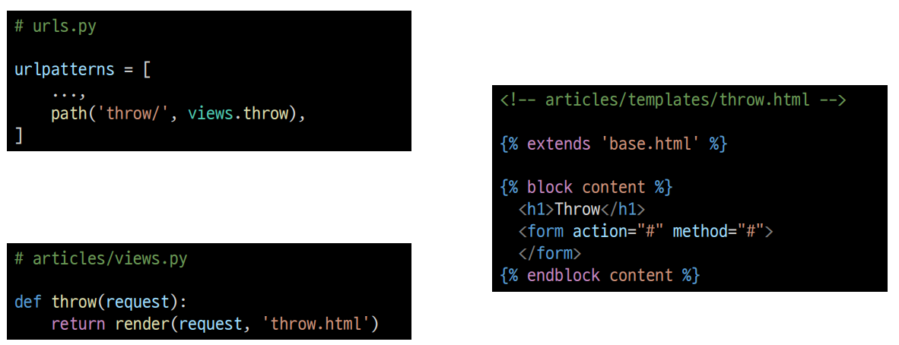

#### HTML  element

- 사용자로부터 데이터를 입력 받기 위해 사용

- “type” 속성에 따라 동작 방식이 달라진다.
  
  - input 요소의 동작 방식은 type 특성에 따라 현격히 달라지므로 각각의 type은 별도로 MDN 문서에서 참고하여 사용하도록 함
  
  - type을 지정하지 않은 경우, 기본값은 ”text”

- 핵심 속성
  
  - name

#### HTML input's attribute

- name
  
  - form을 통해 데이터를 제출(submit)했을 때 name 속성에 설정된 값을 서버로 전송하고, 서버는 name 속성에 설정된 값을 통해 사용자가 입력한 데이터 값에 접근할 수 있음
  
  - 주요 용도는 GET/POST 방식으로 서버에 전달하는 파라미터(name은 key, value는 value)로 매핑하는 것
    
    - GET 방식에서는 URL형식으로 데이터를 전달
      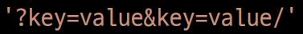

#### HTML \<input> element 작성

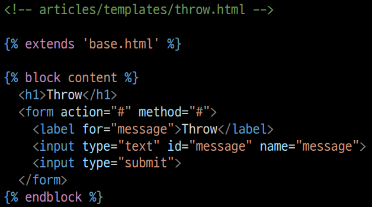

#### HTTP request methods

- HTTP
  
  - HTML 문서와 같은 리소스(데이터, 자원)들을 가져올 수 있도록 해주는 프로토콜(규칙, 규약)

- 웹에서 이루어지는 모든 데이터 교환의 기초

- HTTP는 주어진 리소스가 수행 할 원하는 작업을 나타내는 request methods를 정의

- 자원에 대한 행위(수행하고자 하는 동작)을 정의

- 주어진 리소스(자원)에 수행하길 원하는 행동을 나타냄

- HTTP Method 예시
  
  - GET, POST, PUT, DELETE

- GET이 아닌 다른 method는 추후 다시 알아볼 예정

#### GET

- 서버로부터 정보를 조회하는 데 사용
  
  - 즉, 서버에게 리소스를 요청하기 위해 사용

- 데이터를 가져올 때만 사용해야 함

- 데이터를 서버로 전송할 때 Query String Parameters를 통해 전송
  
  - 데이터는 URL에 포함되어 서버로 보내짐

##### GET 메서드 작성

- GET과 get 모두 대소문자 관계없이 동일하게 동작하지만 명시적 표현을 위해 대문자 사용을 권장

- 데이터를 입력 후 submit 버튼을 누르고 URL의 변화를 확인한다.

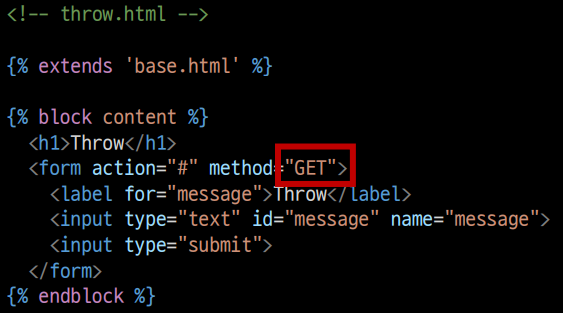

#### Query String Parameters

- 사용자가 입력 데이터를 전달하는 방법 중 하나로, url 주소에 데이터를 파라미터를 통해 넘기는 것

- 이러한 문자열은 앰퍼샌드(&)로 연결된 key=value 쌍으로 구성되며 기본 URL과 물음표(?) 로 구분됨

- 예시) http://host:port/path?key=value&key=value

- Query String이라고도 함

- 정해진 주소 이후에 물음표를 쓰는 것으로 Query String이 시작함을 알림

- “key=value”로 필요한 파라미터의 값을 적음
  
  - “=“ 로 key와 value가 구분됨

- 파라미터가 여러 개일 경우 “&”를 붙여 여러 개의 파라미터를 넘길 수 있음

- 그런데 아직 어디로 보내야(action) 할 지 작성하지 않았다.

### Retrieving the data (Server)

#### Retrieving the data (Server)

- “데이터 가져오기(검색하기)”

- 서버는 클라이언트로 받은 key-value 쌍의 목록과 같은 데이터를 받게 됨

- 이러한 목록에 접근하는 방법은 사용하는 특정 프레임워크에 따라 다름

- 우리는 Django 프레임워크에서 어떻게 데이터를 가져올 수 있을지 알아볼 것
  
  - throw가 보낸 데이터를 catch에서 가져오기
    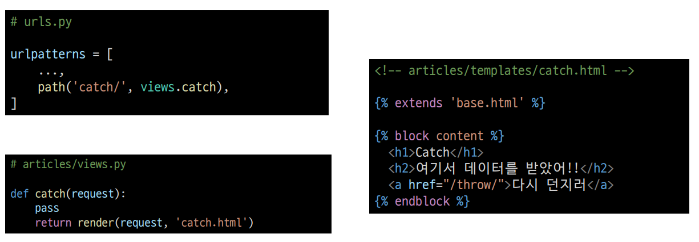

#### action 작성

- throw 페이지에서 form의 action 부분을 마저 작성하고 데이터를 보낸다.

- 실습 편의를 위해 index 페이지에 throw 하이퍼 링크를 작성한다.

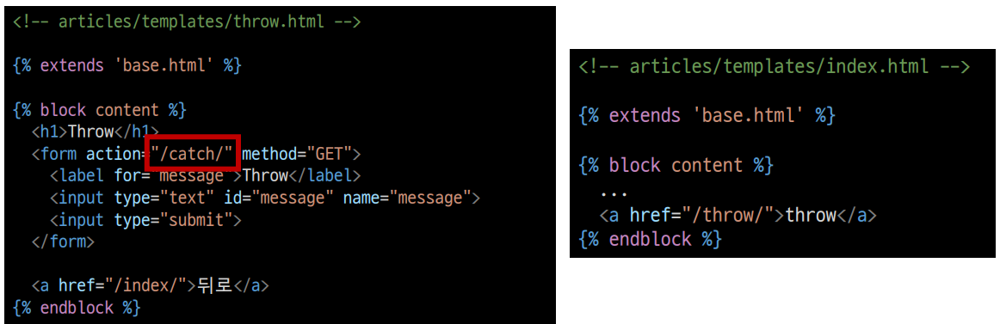

#### 데이터 가져오기

- catch 페이지가 잘 응답되어 출력됨을 확인

- 그런데 throw 페이지의 form이 보낸 데이터는 어디에 들어 있는걸까?

- catch 페이지의 url 확인
  
  
  - GET method로 보내고 있기 때문에 데이터를 서버로 전송할 때 Query String Parameters를 통해 전송
  
  - 즉, 데이터는 URL에 포함되어 서버로 보내짐

- 그러면 우리가 작성해야 하는 view 함수에서는 해당 데이터에 어떻게 접근 가능할까?
  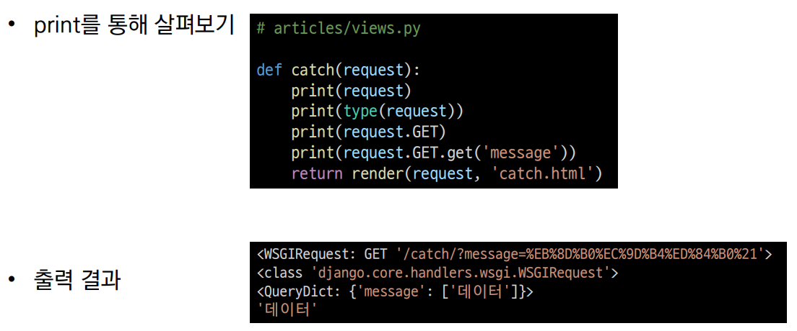
  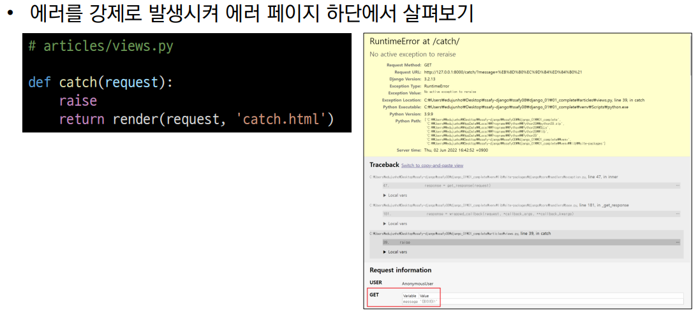
  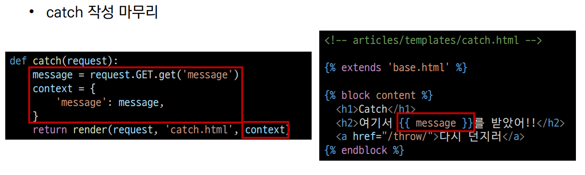
  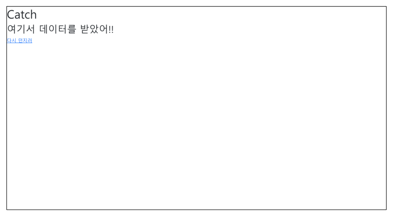

## Request and Response objects

- 요청과 응답 객체 흐름
1. 페이지가 요청되면 Django는 요청에 대한 메타데이터를 포함하는 HttpRequest object를 생성

2. 그리고 해당하는 적절한 view 함수를 로드하고 HttpRequest를 첫번째 인자로 전달

3. 마지막으로 view 함수는 HttpResponse object를 반환

## Django URLs

- 웹 어플리케이션은 URL을 통한 클라이언트의 요청에서부터 시작함

### Trailing Slashes

- Django는 URL 끝에 /가(Trailing slash) 없다면 자동으로 붙여주는 것이 기본 설정
  
  - 그래서 모든 주소가 `/`로 끝나도록 구성 되어있음
  
  - 모든 프레임워크가 이렇게 동작하는 것은 아님

- Django의 url 설계 철학을 통해 먼저 살펴보면 다음과 같이 설명함
  
  - “기술적인 측면에서, foo.com/bar와 foo.com/bar/는 서로 다른 URL이다.”
  
  - 검색 엔진 로봇이나 웹 트래픽 분석 도구에서는 그 둘을 서로 다른 페이지로 봄
  
  - 그래서 Django는 URL을 정규화하여 검색 엔진 로봇이 혼동하지 않게 해야 함
