## Namespace

- URL namespace를 사용하면 서로 다른 앱에서 동일한 URL 이름을 사용하는
  경우에도 이름이 지정된 URL을 고유하게 사용 할 수 있음

- app_name attribute를 작성해 URL namespace를 설정

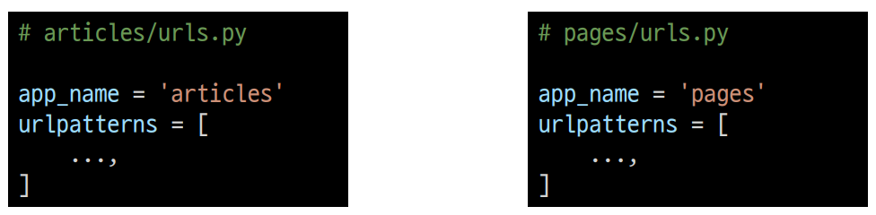

### URL tag 변화

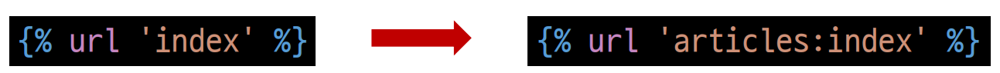

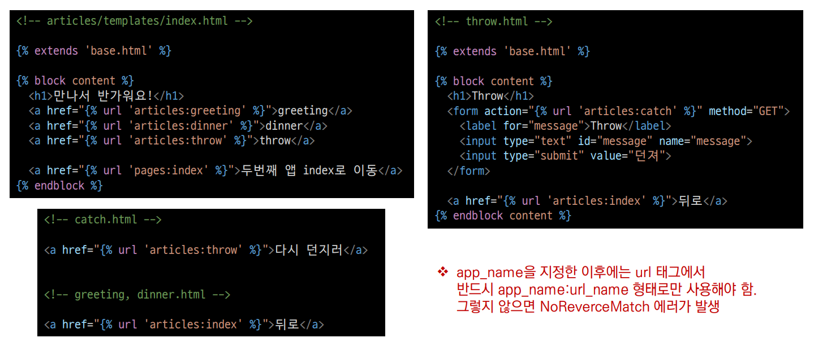

### URL 참조

- ":" 연사자를 사용하여 지정
  
  - 예를 들어, app_name이 articles이고 URL name이 index인 주소 참조는 articles:index가 됨

## Naming URL patterns

### Naming URL patterns의 필요성

- 예를 들어 "index/"의 문자열 주소를 "new-index/"로 바꿔야 한다고 가정하면
  
  - "index/" 주소를 사용한 모든 곳을 찾아서 변경해야 함!

### Naming URL patterns

- 링크에 URL을 직접 작성하는 것이 아니라 “path()” 함수의 name 인자를 정의해서 사용

- DTL의 Tag 중 하나인 URL 태그를 사용해서 “path()” 함수에 작성한 name을 사용할 수 있음

- 이를 통해 URL 설정에 정의된 특정한 경로들의 의존성을 제거할 수 있음

- Django는 URL에 이름을 지정하는 방법을 제공함으로써 view 함수와 템플릿에서 특정 주소를 쉽게 참조할 수 있도록 도움

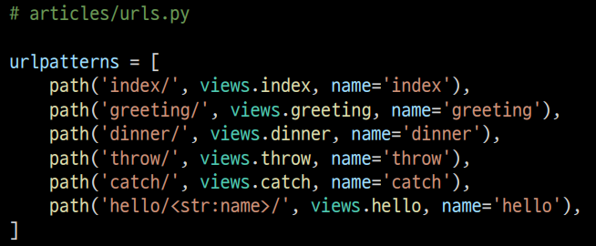

### Built-in tag - "url"

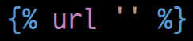

- 주어진 URL 패턴 이름 및 선택적 매개 변수와 일치하는 절대 경로 주소를 반환

- 템플릿에 URL을 하드 코딩하지 않고도 DRY 원칙을 위반하지 않으면서 `링크를 출력하는 방법
  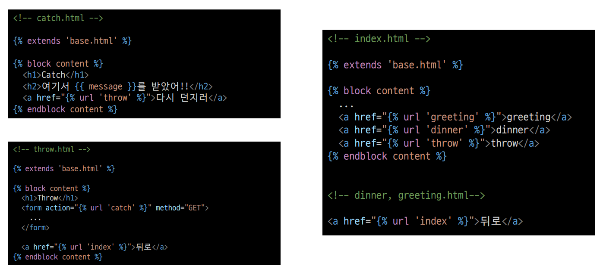

- [참고] DRY 원칙
  
  - Don't Repeat Yourself 약어
  
  - 소스 코드에서 동일한 코드를 반복하지 말자는 의미

## Model

- Django는 model을 통해 데이터에 접근하고 조작

- 사용하는 데이터들의 필수적인 필드들과 동작들을 포함

- 저장된 데이터베이스의 구조 (layout)

- 일반적으로 각각의 모델은 하나의 데이터베이스 테이블에 매핑(mapping)
  
  - 모델 클래스 1개 == 데이터베이스 테이블 1개
  - 매핑 : 하나의 값을 다른 값으로 대응시키는 것
    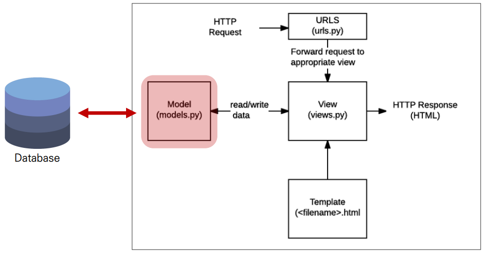

### Model 작성하기

- 새 프로젝트(crud), 앱(articles) 작성 및 앱 등록
  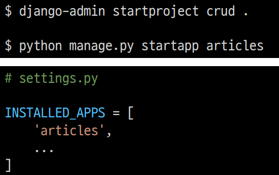

- models.py 작성
  
  - 모델 클래스를 작성하는 것은 데이터베이스 테이블의 스키마를 정의하는 것
  
  - 모델 클래스 == 테이블 스키마
    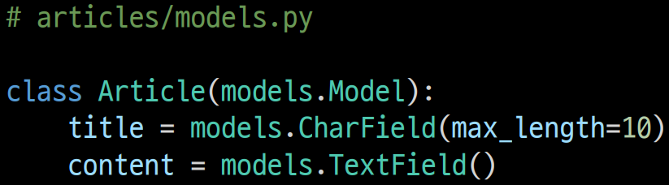

### Model 이해

- 각 모델은 django.models.Model 클래스의 서브 클래스
  
  - 각 모델은 django.db.models 모듈의  Model 클래스를 상속받아 구성됨
    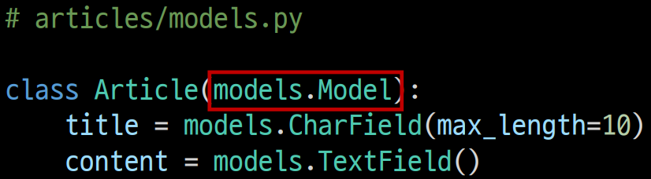

- models 모듈을 통해 어떠한 타입의 DB 필드(컬럼)을 정의할 것인지 정의
  
  - Article에는 어떤 데이터 구조가 필요한지 정의
  
  - 클래스 변수 title과 content는 DB 필드를 나타냄

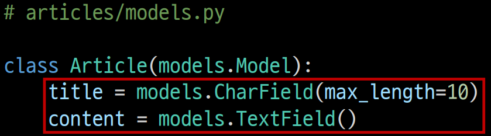

    - 클래스 변수명 + 클래스 변수 값

### Django Model Field

- Django는 모델 필드를 통해 테이블의 필드(컬럼)에 저장할 데이터 유형 (INT, TEXT 등)을 정의

- 데이터 유형에 따라 다양한 모델 필드를 제공
  
  - DataField(), CharField(), IntegerField() 등

## Migrations

1. makemigrations
   
   - 모델의 변경사항에 대한 새로운 migration을 만들 때 사용
   
   - python manage.py makemigrations
   
   - 파이썬으로 작성된 설계도

2. migrate
   
   - makemigrations로 만든 설계도를 실제 데이터베이스에 반영하는 과정(db.sqlite3파일에 반영)
   
   - 모델의 변경사항과 데이터베이스를 동기화
   
   - python manage.py migrate

## 추가 필드 정의

- 추가 모델 필드 작성 후 다시 한번 makemigrations 진행
  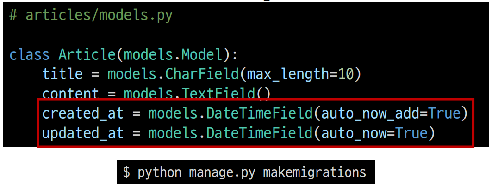

- 기존에 id, title, content 필드를 가진 테이블에 2갱의 필드가 추가되는 상황

- Django 입장에서는 이미 존재하는 테이블에 새로운 컬럼이 추가되는 요구 사항을 받
  았는데, 이러한 컬럼들은 기본적으로 빈 값을 갖고 추가될 수 없음
  
  - 그래서 Django는 우리에게 추가되는 컬럼에 대한 기본 값을 설정해야 하니 어떤 값을 설정할 것인지를 물어보는 과정을 진행
    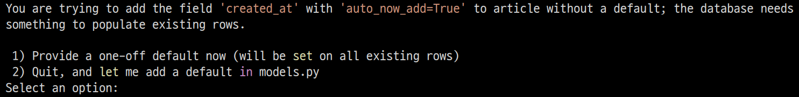
1. 다음 화면으로 넘어가서 새 컬럼의 기본 값을 직접 입력하는 방법

2. 현재 과정에서 나가고 모델 필드에 default 속성을 직접 작성하는 방법
- "1"을 입력 후 Enter(created_at 필드에 대한 default 값 설정)
  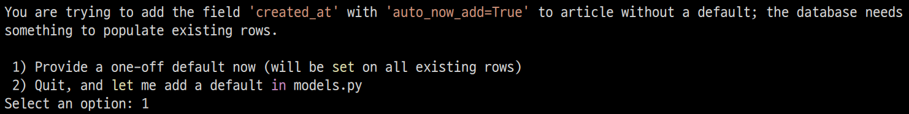

- 다음 화면에서 아무것도 입력하지 않고 Enter를 입력하면 Django에서 기본적으로 파이썬의 timezone 모듈의 now 메서드 반환 값을 기본 값으로 사용하도록 해줌
  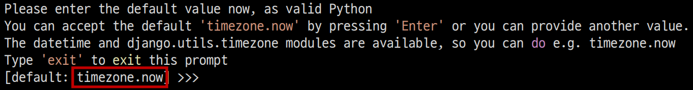

- DB와 동기화 진행
  
  - python manage.py migrate
