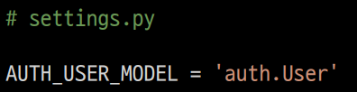

## Django Auth

### Django Auth 개요

- Django authentication system(인증 시스템)은 인증(Authentication)과 권한(Authorization) 부여를 함께 제공
  
  - User
  
  - 권한 및 그룹
  
  - 암호 해시 시스템
  
  - Form 및 View 도구

- Authentication (인증)
  
  - 신원 확인
  
  - 사용자가 자신이 누구인지 확인하는 것

- Authorization (권한, 허가)
  
  - 권한 부여
  
  - 인증된 사용자가 수행할 수 있는 작업을 결정

### 사전 설정

#### accounts app 생성 및 등록

- auth와 관련한 경로나 키워드들을 Django 내부적으로 accounts라는 이름으로 사용하고 있기 때문에 accounts로 지정하는 것을 권장

- 다른 이름으로 설정해도 되지만 나중에 추가 설정을 해야 함!

#### url 분리 및 매핑

## User model 활용

### Django User Model

- Custom User Model로 대체하기

- Django는 기본적인 인증 시스템과 여러 가지 필드가 포함된 User Model을 제공하지만,
  대부분의 개발 환경에서 기본 User Model을 Custom User Model로 대체함

- Django는 새 프로젝트를 시작하는 경우 비록 기본 User 모델이 충분 하더라도
  커스텀 User 모델을 설정하는 것을 강력하게 권장(highly recommended)

- 커스텀 User 모델은 기본 User 모델과 동일하게 작동 하면서도 필요한 경우 나중에 맞춤 설정할 수 있기 때문
  
  - 단, User 모델 대체 작업은 프로젝트의 모든 migrations 혹은 첫 migrate를 실행하기 전에 이 작업을 마쳐야 함

### AUTH_USER_MODEL

- 프로젝트에서 User를 나타낼 때 사용하는 모델

- 프로젝트가 진행되는 동안 (모델을 만들고 마이그레이션 한 후) 변경할 수 없음

- 프로젝트 시작 시 설정하기 위한 것이며, 참조하는 모델은 첫 번째 마이그레이션에서
  사용할 수 있어야 함
  
  - 즉, 첫번째 마이그레이션 전에 확정 지어야 하는 값

- 다음과 같은 기본 값을 가지고 있음

### CustomUserModel로 대체하기

1. AbstractUser를 상속받는 커스텀 User 클래스 작성
   
   - 기존 User 클래스도  AbstractUser를 상속받기 때문에 커스텀 User 클래스도 완전히 같은 모습을 가지고 있음

2. Django 프로젝트에서 User를 나타내는데 사용하는 모델을 방금 생성한
   커스텀 User 모델로 지정

3. admin.py에 커스텀 User 모델을 등록
   
   - 기본 User 모델이 아니기 때문에 등록하지 않으면 admin site에 출력되지 않음

- custom User로 변경된 테이블 확인
  
  - accounts_user 테이블을 사용하게 됨

### User 객체 활용

- User 객체는 인증 시스템의 가장 기본

- 기본 속성
  
  - username
  
  - password
  
  - email
  
  - first_name
  
  - last_name

#### 암호 관리

- 회원은 가입시 일반적으로 암호(password)를 저장이 필수적이며, 별도의 처리가 필요

- Django에서는 기본으로 PBKDF2를 (Password-Based Key Derivation Function) 사용하여 저장
  
  - 단방향 해시함수를 활용하여 비밀번호를 다이제스트로 암호화하며, 이는 복호화가 불가능함
  
  - 단방향 해시함수는 MD5, SHA-1, SHA-256 등이 존재하며, Django는 SHA256 활
  
  - 단방향 해시함수의 경우 레인보우 공격 및 무차별 대입 공격 등의 문제가 발생 가능함
  
  - 이를 보완하기 위하여 아래의 기법을 추가적으로 활용함
    
    - 솔팅(Salting) : 패스워드에 임의의 문자열인 salt를 추가하여 다이제스트를 생성
    
    - 키 스트레칭(Key Stretching) : 해시를 여러 번 반복하여 시간을 늘림

## 회원 가입

### UserCreationForm

- 주어진 username과 password로 권한이 없는 새 user를 생성하는 ModelForm

- 3개의 필드를 가짐
  
  - username (from the user model)
  
  - password1
  
  - password2

- 회원가입에 사용하는 UserCreationForm이 우리가 대체한 커스텀 유저 모델이 아닌
  기존 유저 모델로 인해 작성된 클래스이기 때문에 커스텀이 필요함

### UserCreationForm() 커스텀 하기

- 기존 UserCreationForm을 상속받아  User 모델 재정의
  

- get_user_model()
  
  - 현재 프로젝트에서 활성화된 사용자 모델(active user model)을 반환
  - Django에서는 User 클래스는 커스텀을 통해 변경 가능하여, 직접 참조하는 대신 get_user_model()을 사용할 것을 권장함

