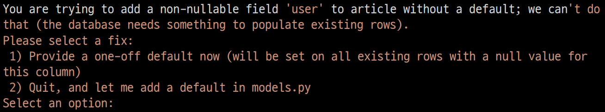
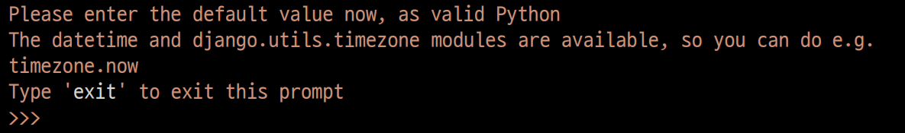

## Migration 이슈

### 첫 번째 화면

- 데이터 베이스가 이미 있는 상태에서 model을 변경하는 경우 기존의 값에 기본적으로 NOT NULL 제약 조건이 있어서 발생하는 오류

- 1을 입력해 기본값을 입력하는 방법 선택

### 두 번째 화면

- 값을 직접 넣어주는 화면

- 마찬가지로 1을 입력하면 기존에 있던 데이터 베이스에 모두 1이 들어가게 됨
