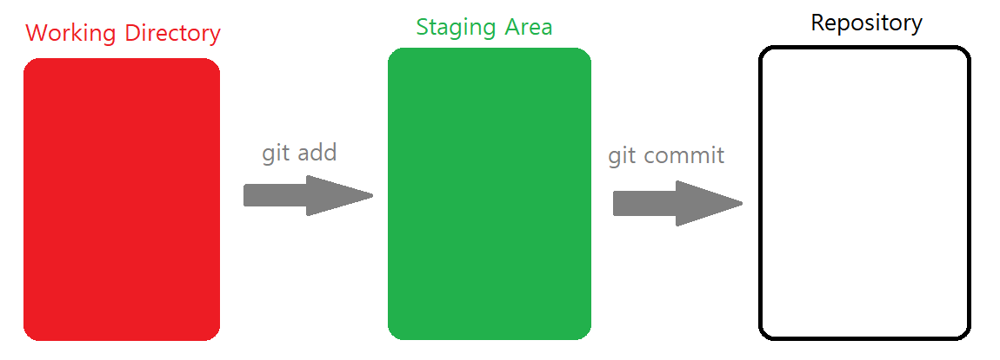
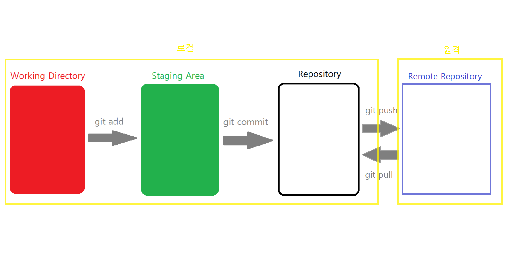

# ⚠사용하기 전 명심⚠

1. git 로컬에서만 편집(수정, 삭제, 생성)

2. 작업 전에 git pull origin master 실행

   (최신 버전으로 업데이트 하고 작업)

# Git

- 🌟 **Git은 분산버전관리시스템(DVCS) ** 🌟
- 모든 히스토리를 클라이언트들이 공유
- 버전 : 컴퓨터 소프트웨어 특정 상태
- 버전 관리 시스템 : 여러 버전을 관리하는 것

❕참고

-  **C**ommand **L**ine **I**nterface(명령 줄 조작) : 명령어 인터페이스
  - ☢ ***명령을 하고 결과를 꼭 읽기!***
  - 터미널을 이용해서 명령
- **G**raphic **U**ser **I**nterface(그래픽 유저 조작)

## 디렉토리 명령어
- CLI 인터페이스를 위한 명령어
- $ : 명령하는 줄의 시작
- **pwd(print working directory)** : 현재 디렉토리 출력
- **cd(change directory)** : 디렉토리 이동 
  - .  : 현재 디렉토리
  -  .. : 상위 디렉토리(cd .. 띄어쓰기 신경쓰기!)
- **ls(list)** : 목록
- **mkdir(make directory)** : 디렉토리 생성(폴더)
- **touch** : 파일의 날짜와 시간을 수정(0바이트 생성) ($ touch a.txt)
- **rm(remove)** : 파일삭제
- **rm -r** : 폴더 삭제
- **Ctrl + L(clear)** : 터미널 기록 삭제
- **Ctrl + C** : 커맨드 명령 취소
- 파일 이름의 띄어쓰기는 역슬래쉬(\\)로 표시 
  - 불편하므로 영어나 _(언더바)로 표시하는 것이 좋다

- 파일 이름 누르고 tap을 누르면 자동으로 경로를 찾아줌.

## Git 원리

1) <u>작업을 하고</u> (1통)
2) <u>변경된 파일을 모아</u> (add) -> staging Area(중간 공간)에 저장 (2통)
   - 파일들이 여러개 있는 경우 부분적으로 버전 생성이 가능하게 만들어줌. 내가 버전으로 기록하기 위한 파일들을 staging Area공간에 모은다.
   - 임시 공간
3) <u>버전으로 남긴다</u> (commit) (3통)

# GitHub

🌟 **GitHub도 버전을 관리한다!  **🌟

- Git은 본인의 컴퓨터(로컬)에서, GitHub는 원격으로 버전을 관리한다.

- GitHub에 원격저장소를 먼저 만든 후, 로컬에서 세팅해준다.

  1. new repository -> 이름 설정 후 저장소 생성(이름이 곧 주소가 됨) -> 주소 확인

     > h&#8203;ttps://github.com/사용자id/저장소이름.git

  2. 로컬 저장소(git으로 관리할 폴더)에 설정한다.

     > $ git remote add origin h&#8203;ttps://github.com/사용자id/저장소이름.git
     >
     > 당분간 저장소 이름에 origin을 사용한다.

  3. 저장소 확인을 한다.

     > $ git remote -v

### Push

- 로컬 저장소에서 원격 저장소로 변경 사항을 올리기 위해 사용
  - $ git push <저장소 이름><브랜치 이름>
  - 당분간 $ git push origin master 을 사용함.
- 만약 변경사항이 없다면 push 되지 않는다!

### Pull

- 원격 저장소의 변경 사항을 로컬 저장소에 가져와 병합하기 위해 사용
  - $ git pull <원격저장소 이름><브랜치 이름>
  - 당분간 $ git pull origin master 을 사용함.

### Clone

- 원격 저장소의 변경사항을 그대로 가져오기 위해 사용
  - $ git clone <원격저장소주소>

# Git/GitHub 명령어

- **$ git init** -> (master) git에 기록하기 시작할 장소에서 시작. 해당 폴더의 변경사항들이 관리됨

- **$ git add <file>** : 1통->2통, 빨간색에서 초록색으로 변경. 파일이 옮겨지는 것이 아닌 상태가 변경

  - **$ git add .** : 모든 파일을 add시킴

- **$ git commit -m '<커밋메시지>'**  : 2통->3통

  커밋메시지는 상세하게 적어 무슨 수정이 생겼는지 알 수 있게 하는 것을 추천.

- **$ git push origin master** : 로컬 저장소 -> 원격 저장소로 변경사항 저장

- **$ git pull origin master** : 원격 저장소 -> 로컬 저장소로 변경사항 저장

---

- **$ git status** : git이 추적하는 현재 파일들의 상태 조회.
  - cd .git : git으로 들어가는 방법 -> (GIT_DIR!) ☠ 혼나기 싫으면 들어가지 말 것!  ☠

- **$ git log** : 저장소에 기록된 커밋(버전)을 조회.
  - git log -1 : 최근 1개(바로 직전)의 커밋을 조회
  - git log --oneline : 한 줄로 보여줘
  - git log -2 --oneline : 최근 2개를 한 줄로 보여줘
  - git log --oneline --graph :  그래프로 보여줘

- **$ git remote -v** : 저장소 확인

---

- **$ git remote add origin h&#8203;ttps://github.com/사용자id/저장소이름.git** : 원격저장소에 origin으로 추가해. 새로운 원격저장소 경로 설정. 한 번만!

# 다양한 기능

## .gitignore

- 버전 관리에 필요하지 않은 파일들 혹은 보안상 업로드 되면 안 되는 파일들 무시하는 기능.
- Git저장소에 .gitigore 파일을 생성하고 안의 내용에 특정 파일, 디렉토리, 확장자 등을 넣으면 인식되지 않는다.
- 커밋 하기 전에 미리 작성해놓자!

