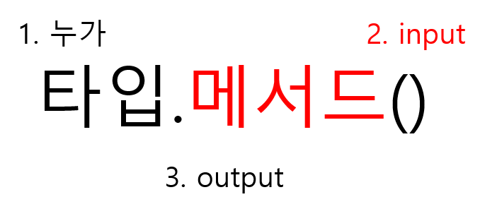

# 데이터 구조

## 메서드(methods)




```python
# 리스트 메서드 활용
a = [10, 1, 100]
new_a = a.sort()
print(a, new_a)
#[1, 10, 100] None
# 리스트 메서드를 활용하면, 그 메서드를 정렬된 상태로 변경(원본 변경)
# return되는 것은 None


#리스트에 sorted 함수를 활용
b = [10, 1, 100]
new_b = sorted(b)
print(b, new_b)
# [1, 10, 100] [1, 10, 100]
# sorted 함수를 활용하면, 원본을 변경하지 않음
# return되는 것은 정렬된 리스트

# 실제 활용 코드
a = [10, 1, 100]
a.sort()
# a를 정렬된 상태로 활용

```

메서드 : S.V()

함수 : 함수명()


### 시퀀스

#### 문자열(String)

- 문자들의 나열
  - 모든 문자는 str 타입
- 작은 따옴표(')나 큰 따옴표(")를 사용해 표현

| 문법        | 설명                                    |
| ----------- | --------------------------------------- |
| s.find(x)   | x의 첫 번째 위치 반환. 없으면 -1 반환   |
| s.index(x)  | x의 첫 번째 위치 반환, 없으면 오류 발생 |
| s.isalpha() | 알파벳 문자 여부(유니코드 상 letter)    |
| s.isupper() | 대문자 여부                             |
| s.islower() | 소문자 여부                             |
| s.istitle() | 타이틀 형식(단어 첫 글자가 대문자) 여부 |

##### 문자열 관련 ~ 메소드

- .find(x)
  - x의 첫번째 위치를 반환. 없으면 -1을 반환

```python
print('apple'.find('p')) #1
print('apple'.find('k')) #-1
```


- .index(x)
  - x의 첫번째 위치를 반환. 없으면 오류 발생

```python
print('apple'.index('p')) #1
'apple'.index('k') #error
```


- isdecimal()
  - 숫자 찾을 때 사용

##### 문자열 변경

| 문법                           | 설명                                       |
| ------------------------------ | ------------------------------------------ |
| s.replace(old, new[, count])   | 바꿀 대상 글자를 새로운 글자로 바꿔서 반환 |
| s,strip([chars])               | 공백이나 특정 문자를 제거                  |
| s.split(sep=None, maxsplit=-1) | 공백이나 특정 문자를 기분으로 분리         |
| 'separator'.join([iterable])   | 구분자로 iterable을 합침                   |
| s.capitalize()                 | 가장 첫 번째 글자를 대문자로 변경          |
| s.title()                      | '나 공백 이후를 대문자로 변경              |
| s.upper()                      | 모두 대문자로 변경                         |
| s.lower()                      | 모두 소문자로 변경                         |
| s.swapcase()                   | 대 소문자 서로 변경                        |


- .replace(old, new[,count])
  - 바꿀 대상 글자를 새로운 글자로 바꿔 반환
  - count를 지정하면 해당 횟수만큼만 시행

```python
'coone'.replace('o', 'a')
# caane
'wooooowoo'.replace('o', '!', 2)
#w!!ooowooo
```

- .strip([chars])
  - 특정한 문자들을 지정하면 양쪽제거(strip) 왼쪽제거(lstrip) 오른쪽제거(rstrip)
  - <u>문자열을 지정하지 않으면 공백(space, \n)을 제거함.</u>


```python
print('        와우!\n'.strip()) # '와우!'
print('        와우!\n'.lstrip()) # '와우!\n'
print('        와우!\n'.rtrip()) # '       와우!'
print('안녕하세요????'.rstrip('?')) # '안녕하세요'
```


- .split(sep=None, maxsplit=-1)
  - 문자열을 특정한 단위로 나눠 <u>리스트로 반환</u>
- 'separator'.join([iterable])
  - 반복가능한 컨테이너 요소들을 separator(구분자)로 합쳐 <u>문자열 반환</u>
  - 문자열이 아닌 값이 있으면 typeerror 발생

```python
print(''.join(['3','5'])) #35
```


#### 리스트(List)

- 변경 가능한 값들의 나열된 자료형
- 순서O, 서로 다른 타입의 요소를 가질 수 있음
- 변경 가능. 반복 가능
- 항상 대괄호 형태로 정의, 요소는 콤마로 구분

| 문법                   | 설명                                                         |
| ---------------------- | ------------------------------------------------------------ |
| L.append()             | 리스트 마지막에 항목 x를 추가                                |
| L.insert(i, x)         | 리스트 인덱스 i에 항목 x를 삽입                              |
| L.remove(x)            | 리스트 가장 왼쪽에 있는 항목(첫 번째) x를 제거. 항목이 존재하지 않을 경우, ValueError |
| L.pop()                | 리스트 가장 오른쪽에 있는 항목(마지막)을 반환 후 제거        |
| L.pop(i)               | 리스트의 인덱스 i에 있는 항목을 반환 후 제거                 |
| L.extend(m)            | 순회형 m의 모든 항목들의 리스트 끝에 추가(+=과 같은 기능)    |
| L.index(x, start, end) | 리스트에 있는 항목 중 가장 왼쪽에 있는 항목 x의 인덱스를 반환 |
| L.reverse()            | 리스트를 거꾸로 정렬                                         |
| L.sort()               | 리스트를 정렬 (매개변수 이용가능)                            |
| L.count(x)             | 리스트에서 항목 x가 몇 개 존재하는지 갯수를 반환             |

- **.append(x)**
  - 리스트에 값을 추가함
- .extend(iterable)
  - 리스트에 iterable 항목 추가

- .insert(i,x)
  - 정해진 위치 i에 값을 추가함
- .remove(x)
  - 리스트에서 값이 x인 것 삭제
- **.pop(i)**
  - 정해진 위치 i에 있는 값을 삭제. 그 항목을 반환
  - i가 지정되지 않으면, 마지막 항목을 삭제하고 반환함
- .clear()
  - 모든 항목 삭제
- .index(x)
  - x값을 찾아 해당 index 반환
- .count(x)
  - 원하는 값의 개수를 반환함
- .sort()
  - 원본 리스트를 정렬함. None 반환
  - sorted 함수 : 정렬된 리스트 반환, 원본 변경x
- .reverse()
  - 순서를 반대로 뒤집음(정렬x). None 반환


### 컬렉션

#### 세트(set)

- 많이 쓰이지 않음

#### 딕셔너리(Dictionary)

- 키-값(key-value) 쌍으로 이뤄진 모음
  - 키(key) : 불변 자료형만 가능 (리스트, 딕셔너리 등은 불가능)
  - 값(valuse) : 어떤 형태 관계 없음
  - 키와 값은 :로 구분. 개별 요소는 ,로 구분
  - 변경 가능. 반복 가능

| 문법              | 설명                                                         |
| ----------------- | ------------------------------------------------------------ |
| d.clear()         | 모든 항목을 제거                                             |
| d.keys()          | 딕셔너리 d의 모든 키를 담은 뷰를 반환                        |
| d.values()        | 딕셔너리 d의 모든 값을 담은 뷰를 반환                        |
| d.items()         | 딕셔너리 d의 모든 키-값의 쌍을 담은 뷰를 반환                |
| d.get(k)          | 키 k의 값을 반환하는데, 키 k가 딕셔너리 d에 없을 경우 None을 반환 |
| d.get(k, v)       | 키 k의 값을 반환하는데, 키 k가 딕셔너리 d에 없을 경우 v를 반환 |
| d.pop(k)          | 키 k의 값을 반환하고 키 k인 항목을 딕셔너리 d에서 삭제하는데, 키 k가 딕셔너리 d에 없을 경우 KeyError 발생 |
| d.pop(k, v)       | 키 k의 값을 반환하고 키 k인 항목을 딕셔너리 d에서 삭제하는데, 키 k가 딕셔너리 d에 없을 경우 v를 반환 |
| d.update([other]) | 딕셔너리 d의 값을 매핑하여 업데이트                          |


- **.get(key[,default])**

  - key를 통해 value를 가져옴

  - keyError가 발생하지 않음.

  - default 값을 설정할 수 있음(기본 : None)

    ```python
    my_dict = {'apple:사과'}
    my_dict['pineapple'] #에러 발생
    my_dict.get('pineapple') #None
    my_dict.get('apple') #사과
    my_dict.get('pineapple',0) #0
    ```

    

- .pop(key[,default])
  - key가 딕셔너리에 있으면 제거하고 해당 값 반환
  - 그렇지 않으면 default 반환
  - default값이 없으면 keyError

```python
my_dict = {'apple' ; '사과', 'banana':'바나나'}
data = my_dict.pop('pineapple')
print(data, my_dict)
```


- .update([other])
  - 값을 제공하는 key, value로 덮어씀

```python
my_dict = {'apple' ; '사', 'banana':'바나나'}
my_dict.update(apple='사과')
print(my_dict) #{'apple' ; '사', 'banana':'바나나'}
```


