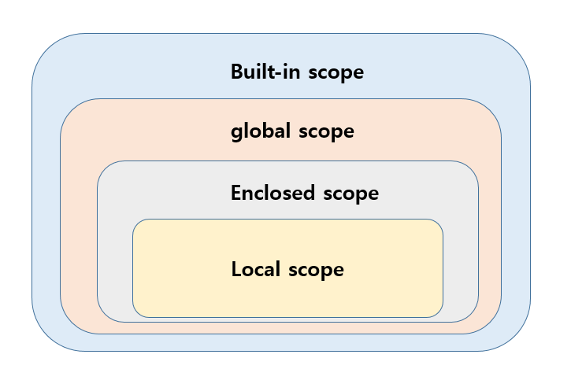

# 함수(function)

1. Decomposition : 기능을 분해, 재사용 가능
2. Abstraction : 복잡한 내용을 숨기고, 기능에 집중하여 사용할 수 있음(블랙박스), 재사용성, 가독성, 생산성. 추상


## 함수의 정의

- 특정한 기능을 하는 코드의 조각(묶음)
- 특정 명령을 수행하는 코드르 매번 다시 작성하지 않고, 필요시에만 호출하여 사용
- 코드 중복 방지, 재사용 용이

! 참고 사이트 !

[파이썬 자습서](https://docs.python.org/ko/3/tutorial/index.html)

[파이썬 표준 라이브러리](https://docs.python.org/ko/3/library/index.html)

### 사용자 함수(Custom function)

- 구현되어 있는 함수가 없는 경우, 사용자가 직접 함수 작성 가능

```python
def function_name
	# code_block
    return returning_value
```

## 함수 기본 구조

### 선언과 호출(define & call)

- 함수의 선언은 def 키워드
- 들여쓰기를 통해 실행될 코드 블록 작성
- parameter를 넘겨줄 수 있음
- 동작 후에 return을 통해 결과값을 전달함
- 함수는 함수명()으로 호출
  - parameter가 있는 경우, 함수명(값1, 값2, ...)로 호출
- 함수는 호출되면 코드를 실행하고 return 값을 반환하며 종료된다.


### 입력(Input)

- parameter : 함수를 실행할 때, 함수 내부에서 사용되는 식별자

- argument

  - 함수 호출 시 함수의 parameter를 통해 전달되는 값

  - 필수 Argument : 반드시 전달되어야 함

  - 선택 Argument : 

  - positional arguments

    - 기본적으로 함수 호출 시 Argument는 위치에 따라 함수 내에 전달됨

      ```python
      def add(x,y)
      	return x + y
      add(2,3)
      ```

  - keyword arguments

    - 직접 변수의 이름으로 특정 Argument를 전달할 수 있음

    - keyword argument 다음에 positional argument를 활용할 수 없음
  
      ```python
      def add(x, y):
          return x + y
      add(x=2, y= 5)
      add(2, y=5)
      #add(x=2, 5)는 불가
      ```

  - Default Arguments Values

    - 기본값을 지정하여 함수 호출 시 argument값을 설정하지 않도록 함
  
      ```python
      def add(x, y=0):
          return x + y
      
      add(2)
      ```
  
  - 정해지지 않은 개수의 arguments

    - 여러 개의 positional argument를 하나의 필수 parameter로 받아서 사용

    - arguments들은 튜플로 묶임

    - parameter에 *
  
      ```python
      def add(*args):
          for arg in args:
              print(arg)
              
      add(2)
      add(2,3,4,5)
      ```
  
  - 정해지지 않은 개수의 keyword arguments
  
    - 함수가 임의의 개수 Argument를 Keyword arguments로 호출될 수 있도록 지정
  
    - argument들은 딕셔너리로 묶임.
    
    - parameter에 **
    
      ```python
      def family(**kwargs):
          for key, value in kwargs:
              print(key, ":", value)
              
      family(father='John', mother ='Jane', me='John Jr.')
      ```
    
      
    

### 범위(Scope)

- 함수는 코드 내부에 local scope 생성, 그 외의 공간에 globe scope로 구분
- scope
  - global scope : 코드 어디에서든 참조할 수 있는 공간
  - local scope : 함수가 만든 scope. 함수 내부에서만 참조 가능

- variable
  - global variable : global scope에 정의된 변수
  - local variable : local scope에 정의된 변수


#### 객체 수명주기

- built-in scope : 파이썬이 실행된 이후부터 영원히 유지
- global scope : 모듈이 호출된 시점 이후 혹은 인터프리터가 끝날 때까지 유지
- local scope : 함수가 호출될 때 생성되고, 함수가 종료될 때까지 유지

#### 이름 검색 규칙(Name Resuolution)

- 파이썬에서 사용되는 이름들은 이름공간(name space)에 저장

  

- Local scope  : 함수
- Enclosed scope : 특정 함수의 상위 함수
- Global scope : 함수 밖의 변수, import 모듈
- Built-in scope : 파이썬 안에 내장되어 있는 함수 또는 속성
- LEGB Rule : L -> E -> G -> B 순서로 이름을 찾아 나감
- 함수 내에서는 바깥 scope의 변수에 접근 가능하나 수정 불가


### 결과값(Output)

#### return

- 함수는 반드시 값을 하나만 return
  - 명시적인 return이 없는 경우 None 반환
- return과 동시에 실행 종료
- 2개의 값을 동시에 반환 -> 1개의 튜플 반환

```python
def ~~
~~
return x+y, x*y
```

- return이 없음 -> none으로 반환


## 함수 응용

- map(function, iterable)

  - 순회 가능한 데이터구조의 모든 요소에 함수를 적용하고 결과를 반환

- n, m = map(int, input().split())