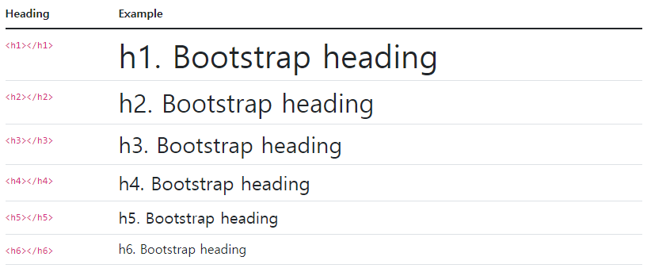
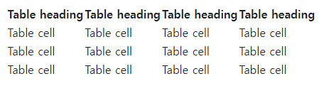

[Bootstrap]([Get started with Bootstrap · Bootstrap v5.2](https://getbootstrap.com/docs/5.2/getting-started/introduction/))

## Introduction

1. index.html에 파일 생성
   
   ```html
   <!doctype html>
   <html lang="en">
   <head>
    <meta charset="utf-8">
    <meta name="viewport" content="width=device-width, initial-scale=1">
    <title>Bootstrap demo</title>
   </head>
   <body>
    <h1>Hello, world!</h1>
   </body>
   </html> 
   ```

2. link는 head에, script는 body에 저장

```html
<link href="https://cdn.jsdelivr.net/npm/bootstrap@5.2.0/dist/css/bootstrap.min.css" rel="stylesheet" integrity="sha384-gH2yIJqKdNHPEq0n4Mqa/HGKIhSkIHeL5AyhkYV8i59U5AR6csBvApHHNl/vI1Bx" crossorigin="anonymous">
<script src="https://cdn.jsdelivr.net/npm/bootstrap@5.2.0/dist/js/bootstrap.bundle.min.js" integrity="sha384-A3rJD856KowSb7dwlZdYEkO39Gagi7vIsF0jrRAoQmDKKtQBHUuLZ9AsSv4jD4Xa" crossorigin="anonymous"></script>
```

## Layout

### Breakpoints

- breakpoints는 장치 또는 viewport크기에 맞춰 레이아웃이 작동하는 방법

- breakpoint는 반응형 설계의 기본 요소
  
  - 레이아웃을 특정 뷰포트 또는 장치 크기에 맞게 조정할 수 있는 시기를 제어하는데 사용

- 미디어 쿼리를 사용하여 중단점별로 CSS를 설계
  
  - 미디어 쿼리 : 스타일을 조건부로 적용할 수 있는 CSS의 기능

- 모바일 우선 반응형 디자인이 목표
  
  - 부트스트랩의 최소한의 스타일을 적용하여 가장 작은 중단점에서 레이아웃을 만든 후 더 큰 장치에 맞게 디자인을 조정함

#### Available breakpoints

| Breakpoint        | Class infix | Dimensions |
| ----------------- | ----------- | ---------- |
| Extra small       | None        | <576px     |
| Small             | sm          | ≥576px     |
| Medium            | md          | ≥768px     |
| Large             | lg          | ≥992px     |
| Extra large       | xl          | ≥1200px    |
| Extra extra large | xxl         | ≥1400px    |

```css
$grid-breakpoints: (
  xs: 0,
  sm: 576px,
  md: 768px,
  lg: 992px,
  xl: 1200px,
  xxl: 1400px
);
```

## Content

### Reboot

- 요소를 변경하는 CSS의 모음
  
  - box-sizing을 border-box로 지정
  
  - font-size도 조정

#### Heading과 paragraphs

- \<h1>과 \<p>의 margin-top 없고, heading의 margin-bottom은 5rem, paragraphs의 margin-bottom은 1rem



#### horizontal rules

- \<hr>  : border-top으로 스타일이 됨. 투명도 0.25를 가지고 있음

```html
<hr>

<div class="text-success">
  <hr>
</div>

<hr class="border border-danger border-2 opacity-50">
<hr class="border border-primary border-3 opacity-75">
```

#### Lists

- 모든 \<ul>, \<ol>, \<dl> : margin-top 사라짐. margin-bottom: 1rem

#### Inline code

- inline에서 \<code>를 나타내는 경우
- ```html
  For example, <code><section></code> should be wrapped as inline. 
  ```

#### code blocks

- block에서 <code>를 나타내는 경우

```html
<pre><code><p>Sample text here...</p>
<p>And another line of sample text here...</p>
</code></pre>
```

#### Variables

```html
<var>y</var> = <var>m</var><var>x</var> + <var>b</var>
```

#### User input

```html
To switch directories, type <kbd>cd</kbd> followed by the name of the directory.<br>
To edit settings, press <kbd><kbd>ctrl</kbd> + <kbd>,</kbd></kbd>
```

#### Sample output

```html
<samp>This text is meant to be treated as sample output from a computer program.</samp>
```

#### Tables

  

```html
<table>
  <caption>
    This is an example table, and this is its caption to describe the contents.
  </caption>
  <thead>
    <tr>
      <th>Table heading</th>
      <th>Table heading</th>
      <th>Table heading</th>
      <th>Table heading</th>
    </tr>
  </thead>
  <tbody>
    <tr>
      <td>Table cell</td>
      <td>Table cell</td>
      <td>Table cell</td>
      <td>Table cell</td>
    </tr>
    <tr>
      <td>Table cell</td>
      <td>Table cell</td>
      <td>Table cell</td>
      <td>Table cell</td>
    </tr>
    <tr>
      <td>Table cell</td>
      <td>Table cell</td>
      <td>Table cell</td>
      <td>Table cell</td>
    </tr>
  </tbody>
</table>
```

#### Forms

- \<fieldset>은 borders, padding, margin이 없음

- \<label>은 display: inline-block으로 설정되어 있어서 margin이 적용 될 수 있음

- <input>, <select>, <textarea>, <button>들의 margin도 없고, line-height는 inherit으로 설정

- <button>, <input> 버튼들은 crusor: pointer을 가지고 있다.


#### Pointers on buttons

```html
<span role="button" tabindex="0">Non-button element button<
```

### Typography

#### Headings


```html
<h1>h1. Bootstrap heading</h1>
<h2>h2. Bootstrap heading</h2>
<h3>h3. Bootstrap heading</h3>
<h4>h4. Bootstrap heading</h4>
<h5>h5. Bootstrap heading</h5>
<h6>h6. Bootstrap heading</h6>
```

  

```html
<p class="h1">h1. Bootstrap heading</p>
<p class="h2">h2. Bootstrap heading</p>
<p class="h3">h3. Bootstrap heading</p>
<p class="h4">h4. Bootstrap heading</p>
<p class="h5">h5. Bootstrap heading</p>
<p class="h6">h6. Bootstrap heading</p>
```

#### Customizing headings

  

```html
<h3>
  Fancy display heading
  <small class="text-muted">With faded secondary text</small>
</h3>
```

#### Display headings


```html
<h1 class="display-1">Display 1</h1>
<h1 class="display-2">Display 2</h1>
<h1 class="display-3">Display 3</h1>
<h1 class="display-4">Display 4</h1>
<h1 class="display-5">Display 5</h1>
<h1 class="display-6">Display 6</h1>
```

#### Inline text elements

  

```html
<p>You can use the mark tag to <mark>highlight</mark> text.</p>
<p><del>This line of text is meant to be treated as deleted text.</del></p>
<p><s>This line of text is meant to be treated as no longer accurate.</s></p>
<p><ins>This line of text is meant to be treated as an addition to the document.</ins></p>
<p><u>This line of text will render as underlined.</u></p>
<p><small>This line of text is meant to be treated as fine print.</small></p>
<p><strong>This line rendered as bold text.</strong></p>
<p><em>This line rendered as italicized text.</em></p>
```

### Lists

 

```html
<ul class="list-unstyled">
  <li>This is a list.</li>
  <li>It appears completely unstyled.</li>
  <li>Structurally, it's still a list.</li>
  <li>However, this style only applies to immediate child elements.</li>
  <li>Nested lists:
    <ul>
      <li>are unaffected by this style</li>
      <li>will still show a bullet</li>
      <li>and have appropriate left margin</li>
    </ul>
  </li>
  <li>This may still come in handy in some situations.</li>
</ul>
```


## Images

### Responsive images


```html

```