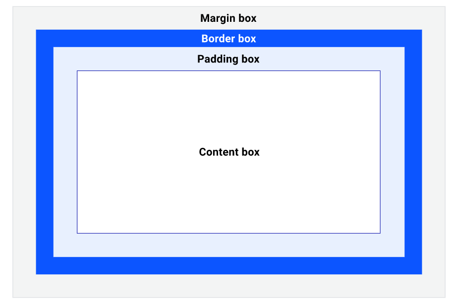
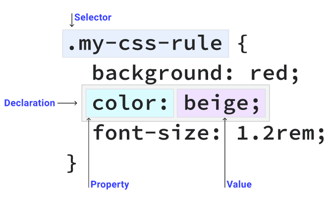
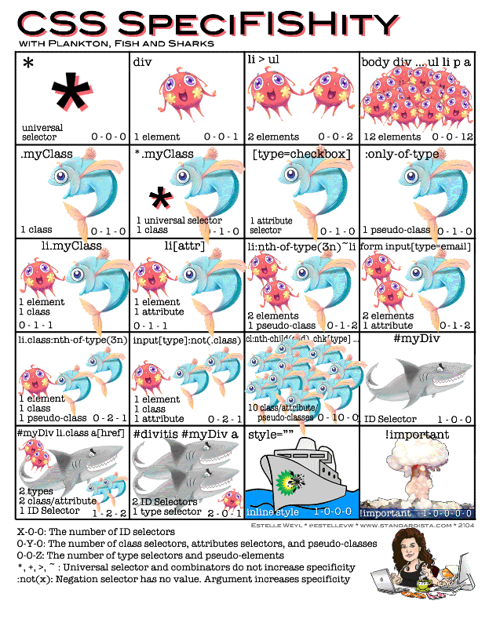

# CSS

## CSS 정의 방법

- 인라인(inline)

- 내부 참조(embedding) - <style>

- 외부 참조(link file) - 분리된 CSS 파일

## CSS 기초 선택자

- 요소 선택자
  
  - HTML 태그를 직접 선택

- 클래스(class) 선택자
  
  - 마침표(.)문자로 시작하며, 해당 클래스가 적용된 항목을 선택

- 아이디(id) 선택자
  
  - \# 문자로 시작하며, 해당 아이디가 적용된 항목을 선택
  
  - 일반적으로 하나의 문서에 한 번만 사용
  
  - 여러 번 사용해도 동작하지만, 단일 id를 사용하는 것을 권장

## 1. 박스 모델

- CSS가 표시하는 모든 것은 박스

### 1.1 콘텐츠 및 크기

- 박스는 display값, 설정된 치수 및 반스 안에 있는 내용에 따라 다르게 동작

- 오버플로 : 콘텐츠가 박스에 비해 너무 큰 경우
  
  - `overflow` 속성을 사용해 요소가 오버플로 콘텐츠를 처리하는 방법 관리

### 1.2 박스 모델의 영역



- 콘텐츠 박스
  
  - 콘텐츠가 있는 영역
  
  - 부모 컨텐츠의 크기 제어 가능 -> 일반적으로 가장 다양한 크기의 영역도 제어

- 패딩 박스
  
  - 콘텐츠 박스를 둘러싸고 있음
  
  - `padding`속성에 의해 생성된 공간
  
  - 박스에 `overflow: auto` 또는 `overflow: scroll`과 같은 오버플로 규칙이 설정되어 있으면 스크롤바도 이 공간을 차지

- 테두리 박스
  
  - 패딩 박스를 둘러싸고 있고 `border`값으로 채움
  
  - 박스의 경계 테두리 가장자리는 시각적으로 볼 수 있는 영역의 한계
  
  - `border` 속성은 요소를 시각적으로 프레임하는 데 사용

- 여백 박스
  
  - 박스의 `margin`규칙에 의해 정의된 박스 주변의 공간

### 1.3 박스 모델 제어

- 에이전트 스타일
  
  - <div> : 요소의 기본 `display`값은 `block`
    
    - `block`항목은 기본적으로 사용 가능한 inline space를 채움
  
  - <li> : 요소의 기본 `display`값은 `list-item`
  
  - <span> : 요소의 기본 `display`값은 `inline`
    
    - `inline`항목 및 `inline-block`요소는 콘텐츠만큼만 커짐

- 박스 크기
  
  - box-sizing : 박스 크기 계산
    
    - box-sizing: content-box;
      
      - `width` 및 `height`가 **content box**에 적용
      
      - 추가적으로 `padding` 및 `border`를 설정하면 콘텐츠 박스의 크기에 추가
    
    - box-sizing: border-box;
      
      - 전체 크기를 일반적으로 사람이 원하는 크기로 지정할 수 있음

```css
.my-box {
  box-sizing: border-box;
    width: 200px;
    border: 10px solid;
    padding: 20px;
}
```

```css
<!-- 모든 박스를 border-box로 만들어주는 코드-->
*,
*::before,
*::after {
  box-sizing: border-box;
}
```

## 2. Selectors(선택기)

- 요소에 CSS를 적용하기 위해 선택해야 함
  

- `my-css-rule`클래스가 있는 모든 요소를 찾는 `.my-css-rule` 중괄호 안에 3개의 선언
  
  - Declaration(선언) : Selector(선택자)와 일지하는 요소에 스타일을 적용하는 Property(속성) 및 beige(값)의 쌍

- 원하는 만큼 많은 선언과 선택기를 가질 수 있음

### 2.1 단순 선택기

#### 2.1.1 범용 선택기

```css
* {
color: hotpink;
}
```

- 페이즈의 모든 HTML 요소가 hotpink 텍스트를 갖도록 함

#### 2.1.2 유형 선택기

```css
section {
  padding: 2em;
}
```

모든 `<section>` 요소가 모든 면에 `padding`의 `2em`을 갖게 함

#### 2.1.3 클래스 선택기

- HTML은 `class` 속성에 하나 이상의 정의된 항목을 가질 수 있음

```html
<div class="my-class"></div>
<button class="my-class"></button>
<p class="my-class"></p>
```

```css
.my-class {
  color: red;
}
```

- 클래스가 적용된 모든 요소는 빨간색으로 표시됨

- `.`이 CSS에만 있는 것 기억하기!

- `.my-class`의 클래스가 있는 HTML 요소가 여러개 있더라도 규칙은 적용됨

```html
<div class="my-class another-class some-other-class"></div>
```

- 숫자로 클래스를 시작할 수는 없음!

#### 2.1.4 ID 선택기

- `id` 속성이 있는 HTML 요소는 해당 ID 값을 가진 유일한 요소여야 함

```css
#rad {
  border: 1px solid blue;
}
```

```html
<div id="rad"></div>
```

- `id`가 `rad`인 HTML 요소에 파란색 테두리를 적용

#### 2.1.5 속성 선택기

- 특정 HTML 속성이 HTML 속성에 대한 특정 값이 있는 요소를 찾을 수 있음

- 대괄호 `[]`로 묶어 CSS가 속성을 찾도록 지시

```css
[data-type='primary'] {
  color: red;
}
```

- `primary` 값을 가진 `data-type` 속성이 잇는 모든 요소를 찾음

```html
<div data-type="primary"></div>
```

- `data-type`의 특정 값을 찾는 대신 값에 관계없이 속성이 있는 요소를 찾을 수도 있음

```css
[data-type] {
  color: red;
}
```

```html
<div data-type="primary"></div>
<div data-type="secondary"></div>
```

- `s` 연산자를 추가하여 대소문자를 구분하는 속성 선택기 사용 가능

- 대소문자 연선자와 함께 속성 값 내의 문자열 부분과 일치하는 연산자에 액세스 가능

#### 2.1.6 그룹화 선택기

- 여러 선택기를 쉼표로 구분하여 그룹화할 수 있음

```css
strong,
em,
.my-class,
[lang] {
  color: re
```

- 색상 변경을 `<strong>` 요소와 `<em>` 요소 모두로 확장

- `.my-class`라는 클래스와 `lang` 속성이 있는 요소로 확장

## The cascade(캐스케이드)

- CSS는 Cascading Stylesheets의 약자

- 캐스케이드는 여러 CSS 규칙이 HTML 요소에 적용되는 충돌을 해결하기 위한 알고리즘

```css
<!-- 버튼의 텍스트가 blue가 됨 -->
button {
  color: red;
}

button {
  color: blue;
}
```

### 알고리즘 단계

1. **위치 및 표시 순서** : CSS 규칙이 표시되는 순서

2. **특이성** : 가장 일치하는 CSS 선택자를 결정하는 알고리즘

3. **오리진**: CSS가 나타나는 순서와 출처, 브라우저 스타일인지, 브라우저 확장 프로그램의 CSS인지, 작성한 CSS인지 여부

4. **중요도**: 몇몇 CSS 규칙은 특히 `!important` 규칙 유형의 경우 다른 규칙보다 가중치가 더 높음

