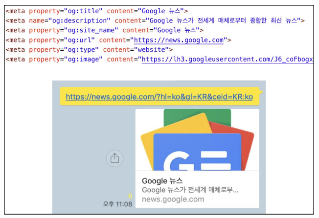
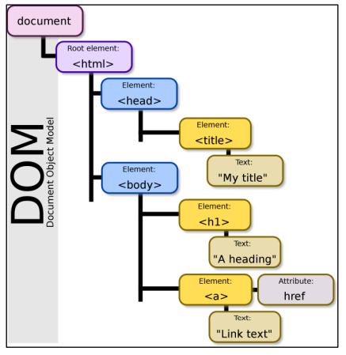
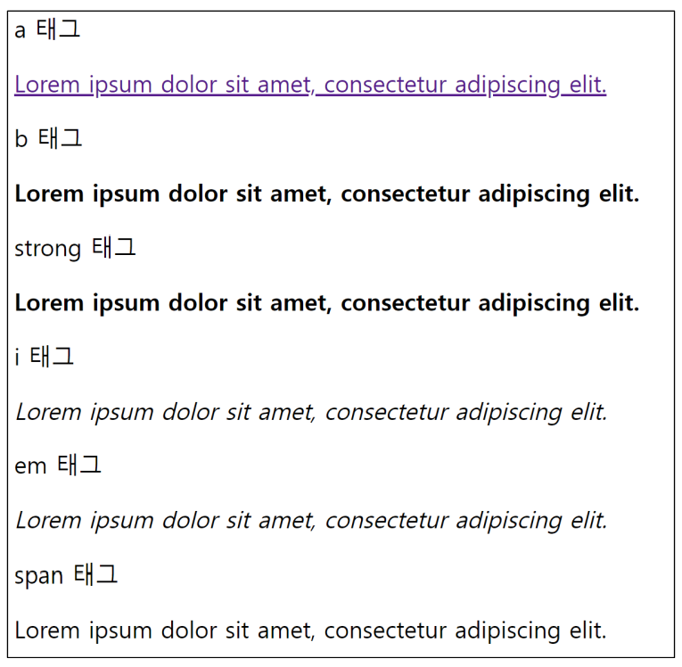
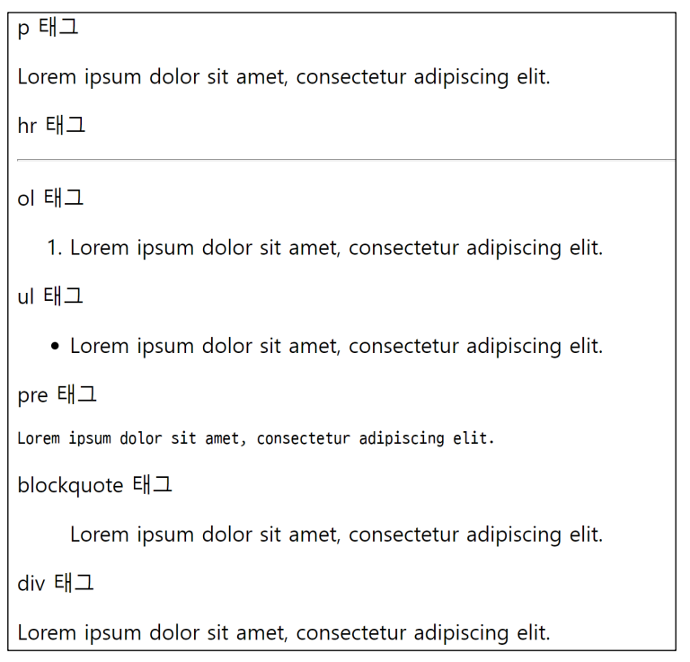
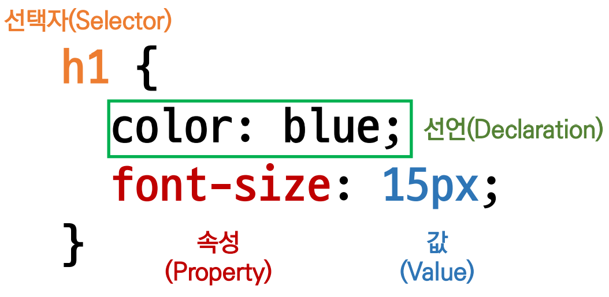

# 웹

- 웹 사이트 구성 요소
  

## 웹 사이트와 브라우저

- 웹 사이트는 부라우저를 통해 동작함
- 브라우저마다 동작이 약간씩 달라서 문제가 생긱는 경우가 많음(파편화)
- 해결책으로 웹 표준 등장

## 웹 표준

- 웹에서 표준적으로 사용되는 기술이나 규칙

- 어떤 브라우저든 웹 페이지가 동일하게 보이도록 함(크로스 브라우징)

- 브라우저별 호환성 체크 사이트
  
  [](https://caniuse.com/)

# 개발 환경 설정

## Visual Studio Code

### HTML/CSS 코드 작성을 위한 Visual Studio Cod 추천 확장 프로그램

1. Open in browser
   
   - visual studio code내에서 브라우저를 오픈하는 확장 프로그램
   
   - **Alt + B**  : 기본 브라우저에서 현재 html 파일을 열기
   
   - **Shift + Alt + B**  : 다른 브라우저를 선택하면 해당 브라우저를 통해 파일을 열 수 있음
   
   - 해당 파일에 마우스 우클릭 

2- Auto Rename Tag

- html에서 태그명 변경시 자동으로 닫힌 태그명까지 바꿔 줌
3. Auto Close Tag
   
   - 자동으로 끝 tag를 만들어줌.

4. Intellisense for CSS class names in HTML
   
   - 작업 공간에 있는 정의를 기반으로 HTML Class 속성에 대한 CSS Class 이름을 자동 완성

5. HTML CSS support 
   
   - html 요소의 class에서 css 선택자 요소를 쓸때 자동 완성 기능을 지원.

## 크롬 개발자 도구

- 웹 브라우저 크롬에서 제공하는 개발과 관련된 다양한 기능을 제공

- 주요 기능
  
  - Elements - DOM 탐색 및 CSS 확인 및 변경
    
    - styles - 요소에 적용된 CSS 확인
    
    - Computed - 스타일이 계산된 최종 결과
    
    - Event Listeners - 해당 요소에 적용된 이벤트(JS)
  
  - Sources, Network, Performance, Application, Security, Audits 등

# HTML 기초

## HTML?

- HTML : <u>Hyper Text</u>  +  <u>Markup Language</u>
  
  - Hyper Text?
    
    - 참조(하이퍼링크)를 통해 사용자가 한 문서에서 다른 문서로 즉시 접근할 수 있는 텍스트
  
  - Markup Language
    
    - 태그 등을 이용하여 문서나 데이터의 구조를 명시하는 언어
      
      - HTML, Markdown 등등

- HTML은 **웹 페이지를 작성(구조화)하기 위한 언어**

- .html (HTML 파일)

# HTML 기본 구조

```html
<!DOCTYPE html>
<html lang="en">
<head>
  <meta charset="UTF-8">
  <title>Document</title>
</head>
<body>

</body>
<html>
```

- html : 문서의 최상위(root) 요소

- head : 문서 메타데이터 요소
  
  - 메타 데이터 : 사진의 메타 데이터 셔터스피드, 노출, 조리개 값, 장소, 시간, 크기 ...                         정보의 정보
  
  - 문서 제목, 인코딩, 스타일, 외부 파일 로딩 등
  
  - 일반적으로 브라우저에 나타나지 않는 내용

- body : 문서 본문 요소
  
  - 실제 화면 구성과 관련된 내용

## head 예시

- \<title\> : 브라우저 상단 타이틀
- \<meta\> : 문서 레벨 메타데이터 요소
- \<link\> : 외부 리소스 연결 요소(CSS 파일, favicon 등)
- \<script\> : 스크립트 요소 (JavaScript 파일/코드)
- \<style\> : CSS 직접 작성

```html
  <head>
    <title>HTML 수업</title>
    <meta charset="UTF-8">
    <link href="style.css" rel="stylesheet">
    <script src="javascripts.js"></script>
    <style>
      p {
        color: black;
      }
    </style>
  </head>
```

### Open Graph Portocol

- 메타 데이터를 표현하는 새로운 규약
  
  - HTML 문서의 메타 데이터를 통해 문서의 정보를 전달
  - 메타정보에 해당하는 제목 설명 등을 쓸 수 있도록 정의
  - 카카오톡에서 링크를 보낼 때 뜨는 미리보기 기능
    

## 요소(element)


- HTML 요소는 태그(시작 태그와 종료 태그)와 내용(태그 사이에 위치)으로 구성
  - 요소는 태그로 컨텐츠(내용)를 감싸는 것. 그 정보의 성격과 의미를 정의
  - 내용이 없는 태그들도 존재(닫는 태그가 없음)
    - br : 행바꿈
    - hr : 수평선 그리기
    - img : 이미지 넣기
    - input : 사용자의 정보를 받음
    - link : 링크
    - meta : 메타 데이터
- 요소는 중첩(nested)될 수 있음
  - 요소의 중첩을 통해 하나의 문서를 구조화
  - 여는 태그와 닫는 태그의 쌍을 잘 확인할 것!
    - 오류를 반환하는 것이 아닌 레이아웃이 깨진 상태로 출력되므로, 디버깅이 힘들 수 있음

## 속성(attribute)


- 태그별로 사용할 수 있는 속성은 다름.
- 속성을 통해 태그의 부가적인 정보를 설정할 수 있음
- 요소는 속성을 가질 수 있으며, 경로나 크기와 같은 추가적인 정보를 제공
- 요소의 시작 태그에 작성하며 보통 이름과 값이 하나의 쌍으로 존재
- 태그와 상관없이 사용 가능한 속성(HTML Global Attribute)들도 있음

### HTML Global Attribute

- 모든 HTML 요소가 공통으로 사용할 수 있는 대표적인 속성(몇몇 요소에는 아무 효과가 없을 수 있음)
  - id : 문서 전체에서 유일한 고유 식별자 지정
  - class : 공백으로 구분된 해당 요소의 클래스의 목록(CSS, JS에서 요소를 선택하거나 접근)
  - data-* : 페이지에 개인 사용자 정의 데이터를 저장하기 위해 사용
  - style : inline 스타일
  - title : 요소에 대한 추가 정보 지정
  - tabindex : 요소의 탭 순서

```html
<!DOCTYPE html>
<html lang="en">
<head>
  <meta charset="UTF-8">
  <title>Documents</title>
</head>
<body>
  <!-- 이것은 주석입니다. -->
  <h1>나의 첫번째 HTML</h1>
  <p>이것은 본문입니다.</p>
  <span>이것은 인라인요소</span>
  <a href="https://www.naver.com">네이버로 이동!!</a>
</body>
</html>
```

## 텍스트로 작성된 코드가 어떻게 웹 사이트가 되는 걸까?

### 렌더링(Rendering)

- 웹 사이트 코드를 사용자가 보게 되는 웹 사이트로 바꾸는 과정

### DOM(Document Object Model) 트리



- 텍스트 파일인 HTML 문서를 브라우저에서 렌더링 하기위한 구조
  - HTML 문서에 대한 모델을 구성함
  - HTML 문서 내의 각 요소에 접근 / 수정에 필요한 프로퍼티와 메서드를 제공함

## 인라인 / 블록 요소

- HTML 요소는 크게 인라인 / 블록 요소로 나눔
- 인라인 요소는 글자처럼 취급
- 블록 요소는 한 줄 모드 사용

### 텍스트 요소

| 태그                            | 설명                                           |
| ----------------------------- | -------------------------------------------- |
| <a></a>                       | href 속성을 활용하여 다른 URL로 연결하는 하이퍼링크 생성          |
| <b></b><br/><strong></strong> | 굵은 글씨 요소<br/>중요한 강조하고자 하는 요소( 보통 굵은 글씨로 표현)  |
| <i></i><br/><em></em>         | 기울임 글씨 요소<br/>중요한 강조하고자 하는 요소(보통 기울임 글씨로 표현) |
| <br>                          | 텍스트 내에 줄 바꿈 생성                               |
| \                       | src 속성을 활용하여 이미지 표현,<br/>alt 속성을 활용하여 대체 텍스트 |
| <span></span>                 | 의미 없는 인라인 컨테이너                               |



### 그룹 컨텐츠

| 태그                        | 설명                                                    |
| ------------------------- | ----------------------------------------------------- |
| <p></p>                   | 하나의 문단(paragraph)                                     |
| <hr>                      | 문단 레벨 요소에서의 주제의 분리를 의미하며 수평선으로 표현됨(A Horizontal Rule) |
| <ol></ol><br/><ul></ul>   | 순서가 있는 리스트(ordered)<br/>순서가 없는 리스트(unordered)         |
| <pre></pre>               | HTML에 작성한 내용을 그대로 표현.<br/>보통 고정폭 글꼴이 사용되고 공백문자를 유지    |
| <blockquote></blockquote> | 텍스트가 긴 인용문<br/>주로 들여쓰기를 한 것으로 표현됨                     |
| <div></div>               | 의미 없는 블록 레벨 컨테이너                                      |



# CSS

- CSS : Cascading Style Sheets
- **스타일을 지정하기 위한 언어**
- 선택하고, 스타일을 지정한다.

```css
h1 {
    color: blue;
    font-size: 15px;
}
```



- CSS 구문은 선택자를 통해 스타일을 지정할 HTML 요소를 선택

- 중괄호 안에서는 속성과 값, 하나의 쌍으로 이루어진 선언을 진행

- 각 쌍은 선택한 요소의 속성, 속성에 부여할 값을 의미
  
  - 속성(Property) : 어떤 스타일 기능을 변경할지 결정
  
  - 값(Value) : 어떻게 스타일 기능을 변경할지 결정


## CSS 정의 방법

- 인라인(inline)

- 내부 참조(embedding) - <style>

- 외부 참조(link file) - 분리된 CSS 파일


## CSS 기초 선택자

- 요소 선택자
  
  - HTML 태그를 직접 선택

- 클래스(class) 선택자
  
  - 마침표(.)문자로 시작하며, 해당 클래스가 적용된 항목을 선택

- 아이디(id) 선택자
  
  - \# 문자로 시작하며, 해당 아이디가 적용된 항목을 선택
  
  - 일반적으로 하나의 문서에 한 번만 사용
  
  - 여러 번 사용해도 동작하지만, 단일 id를 사용하는 것을 권장