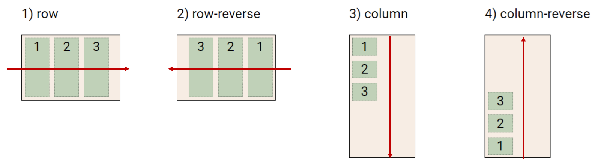

```css
<!-- 처음에 border-box로 변경하면 편
*{
    box-sizing: border-box;
}
```

# CSS Position

- 문서 상에서 요소의 위치를 지정

- static : 모든 태그의 기본 값(기준 위치)
  
  - 일반적인 요소의 배치 순서에 따름(좌측 상단)
  
  - 부모 요소 내에서 배치될 때는 부모 요소의 위치를 기준으로 배치 됨

- 아래는 좌표 프로퍼티(top, bottom, left, right)를 사용하여 이동 가능
  
  1. relative : 상대 위치
     
     - 자기 자신의 static 위치를 기준으로 이동
     - normal flow 유지
  
  2. absolute : 절대 위치
     
     - normal flow에서 벗어남
     
     - static이 아닌 가장 가까이 있는 부모/조상 요소를 기준으로 이동(없는 경우 브라우저 화면 기준으로 이동)
     
     - 보통 부모를 relative를 주고 absolute 활용
  
  3. fixed
     
     - 화면 기준으로 이동
     
     - 스크롤 시에도 항상 같은 곳에 위치.
     
     - 아래쪽에 따라다니는 메뉴
  
  4. sticky
     
     - 스크롤에 따라 statick -> fixed로 변경. 다음주에 배울 예정
     
     - 위에 고정된 메뉴들에 주로 사용

- absolute vs relative


- CSS 원칙

- CSS 원칙 1,2 : Normal flow
  
  - 모든 요소는 네모(박스모델), 좌측상단에 배치
  
  - display에 따라 크기와 배치가 달라짐

- CSS 원칙 3
  
  - position으로 위치의 기준을 변경
    
    - relative : 본인의 원래 위치
    
    - absolute : 특정 부모의 위치
    
    - fixed : 화면의 위치
    
    - sticky : 기본적으로 static이나 스크롤 이동에 따라 fixed로 변경

## CSS layout

- Normal Flow


### Float

- 박스를 왼쪽 혹은 오른쪽으로 이동시켜 텍스트를 포함 인라인 요소들이 주변을 wrapping하도록 함

- 요소가 Normal flow를 벗어나도록 함


## Flexbox

### CSS Flexible Box Layout


- 행과 열 형태로 아이템들을 배치하는 1차원 레이아웃 모델

- 축
  
  - main axis(메인 축)
  
  - cross axis(교차 축)

- 구성 요소
  
  - Flex Container(부모 요소)
  
  - Flex Item(자식 요소)

! 기억 !

1. 부모 요소를 flexbox로 설정하면 안의 아이템들은 자식 요소가 된다.

2. main축이 설정되면 main축과 수직인 축이 생긴다.

### Flexbox 구성 요소

```css
.flex-container{
    display: flex;
}
```

- Flex Container(부모 요소)
  
  - flexbox 레이아웃을 형성하는 가장 기본적이 모델
  
  - **display속성을 flex 혹은 inline-flex로 지정**
  
  - Flex Item들이 놓여있는 영역

- Flex Item (자식 요소)
  
  - 컨테이너에 속해 있는 컨텐츠(박스)

### Flex 속성

- 배치 설정
  
  - flex-directoin
  - flex-flow
    - 축약이므로, 익숙해지면 사용

- 공간 나누기
  
  - justify-content (main axis)
  
  - align-content (cross axis)

- 정렬
  
  - align-items (모든 아이템을 cross axis 기준으로)
  
  - align-self (개별 아이템)

#### Flex 속성 : flex-direction

- **Main axis**를 기준으로 공간 배분
- 역방향의 경우 HTML 태그 선언 순서와 시각적으로 다를 수 있기때문에 잘 적용



#### Flex 속성 : flex-wrap

- 아이템이 컨테이너를 벗어나는 경우 해당 영역 내에 배치되도록 설정

- 기본적으로 컨테이너 영역을 벗어나지 않도록 함


#### Flex 속성 : flex-direction & flex-wrap

- flex-direction : Main axis의 방향을 설정

- flex-wrap : 요소들이 강제로 한 줄에 배치 되게 할 것인지 여부 설정
  
  - nowrap(기본 값) : 한 줄에 배치
  
  - wrap : 넘치면 그 다음 줄로 배치

- flex-flow : 둘을 합친 것. 익숙해지면 공부

#### Flex 속성 : justify-content

- Main axis를 기준으로 공간 배분


#### Flex 속성 : align-content - 지금은 넘어감

#### Flex 속성 : align-itmes

- 모든 아이템을 Cross axis를 기준으로 정렬


#### Flex 속성 : align-self

- 개별 아이템을 Cross axis 기준으로 정렬
  
  - 주의! 해당 속성은 컨테이너에 적용하는 것이 아니라 개별 아이템에 적용!


#### 기타 속성

- flex-grow : 남은 영역을 아이템에 분배

- order : 배치 순서


#### 활용 레이아웃 - 수직 수평 가운데 정렬

```css
/* 방법1 컨테이너 설정 */

.container {
    display: flex;
    justify-content: center;
    align-items: center;
}


/* 방법2 아이템 설정 */
.container{
display: flex;
}

.item{
margin: auto;
}
```

#### 활용 레이아웃 - 카드 배치

```css
#layout_03 {
    display: flex;
    flex-direction: column;
    flex-wrap: wrap;
    justify-content: space-around;
    align-content: space-around;
}
```

- 2차원은 grid로 만듦