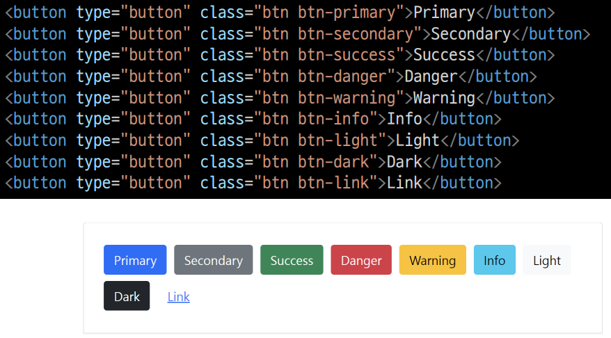
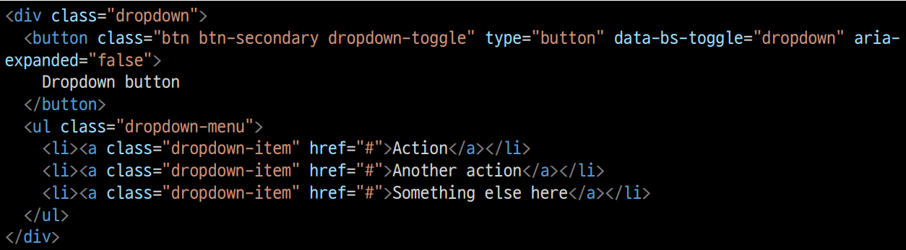
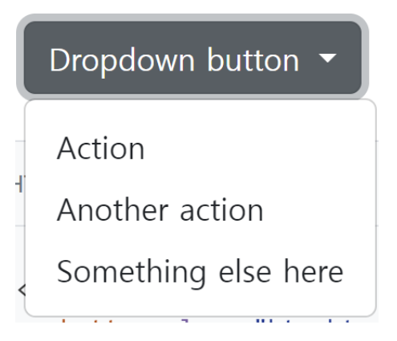
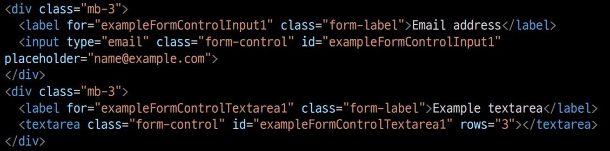
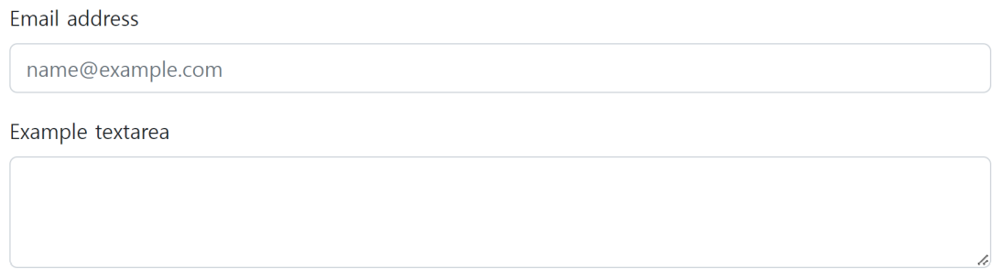
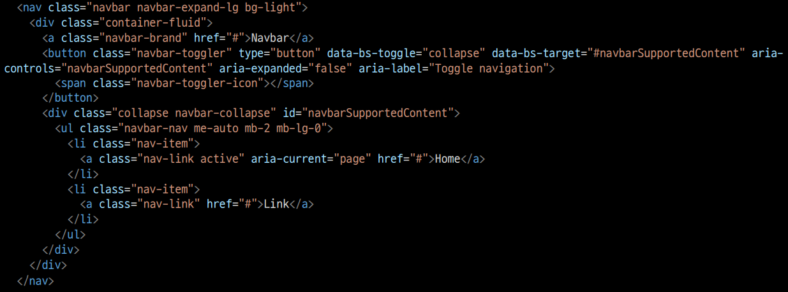
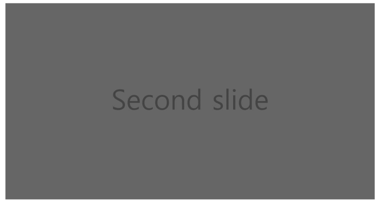
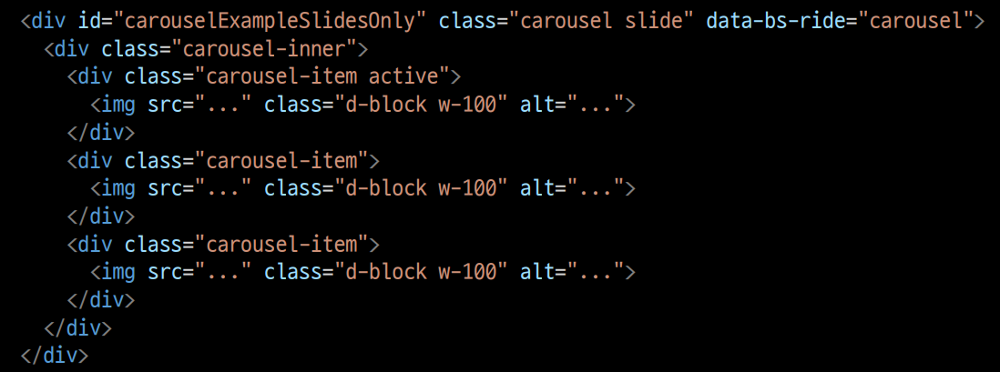
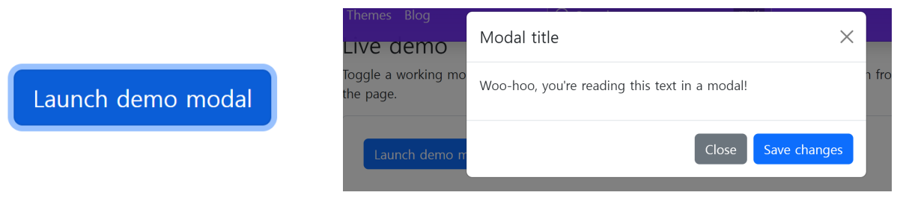
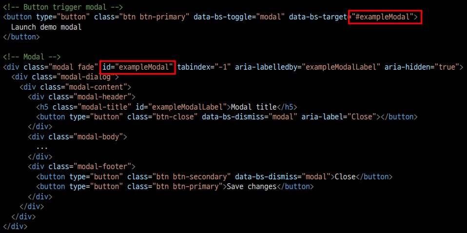

# Bootstrap 컴포넌트

- Bootstrap의 다양한 UI 요소를 활용할 수 있음

## Buttons

- 클릭했을 때 어떤 동작이 일어나도록 하는 요소

## Dropdowns

- dropdown, dropdown-menu, dropdown-time 클래스를 활용해 옵션 메뉴를 만들 수 있음

## Forms > Form contorls

- form-control 클래스를 사용해 \<input> 및 \<form> 태그를 스타일링할 수 있음.
  
  

## Navbar

- navbar 클래스를 활용하면 네비게이션 바를 제작할 수 있음.
  
  

## Carousel

- 콘텐츠(사진)을 순환시키기 위한 슬라이드쇼
  
  

## Modal

- 사용자와 상호작용 하기 위해서 사용하며, 주로 긴급 상황을 알리는 데 사용

- 현재 열려 있는 페이지 위에 또 다른 레이어를 띄움

- 페이지를 이동하면 자연스럽게 사라짐(옵션에 따라 모달 외 클릭 안되는 경우도 있음)
  

- Modal은 자바스크립트를 활용하며, 반드시 target과 id가 일치되어야 함.
  